# AnimAI Studio — AI-Powered Educational Animation Generator

### Project Report

---

## TABLE OF CONTENTS

| Section | Page |
|---------|------|
| ACKNOWLEDGEMENT | 3 |
| ABSTRACT | 4 |
| **CHAPTER 1: INTRODUCTION** | **5** |
| &nbsp;&nbsp;&nbsp;&nbsp;1.1 Problem Statement | 5 |
| &nbsp;&nbsp;&nbsp;&nbsp;1.2 Challenges | 5 |
| &nbsp;&nbsp;&nbsp;&nbsp;1.3 Objective | 6 |
| **CHAPTER 2: HARDWARE AND SOFTWARE REQUIREMENTS** | **7** |
| &nbsp;&nbsp;&nbsp;&nbsp;2.1 Technology Stack | 7 |
| &nbsp;&nbsp;&nbsp;&nbsp;2.2 System Requirements | 9 |
| **CHAPTER 3: FUNCTIONAL REQUIREMENTS** | **10** |
| &nbsp;&nbsp;&nbsp;&nbsp;3.1 Teacher Agent Functions | 10 |
| &nbsp;&nbsp;&nbsp;&nbsp;&nbsp;&nbsp;&nbsp;&nbsp;3.1.1 Pedagogical Curriculum Design | 10 |
| &nbsp;&nbsp;&nbsp;&nbsp;&nbsp;&nbsp;&nbsp;&nbsp;3.1.2 Intent Classification | 10 |
| &nbsp;&nbsp;&nbsp;&nbsp;&nbsp;&nbsp;&nbsp;&nbsp;3.1.3 5-Beat Learning Arc Generation | 10 |
| &nbsp;&nbsp;&nbsp;&nbsp;3.2 Planner Agent Functions | 11 |
| &nbsp;&nbsp;&nbsp;&nbsp;&nbsp;&nbsp;&nbsp;&nbsp;3.2.1 Animation Plan Generation | 11 |
| &nbsp;&nbsp;&nbsp;&nbsp;&nbsp;&nbsp;&nbsp;&nbsp;3.2.2 5-Segment Video Structure | 11 |
| &nbsp;&nbsp;&nbsp;&nbsp;&nbsp;&nbsp;&nbsp;&nbsp;3.2.3 Topic Visual Hints Integration | 11 |
| &nbsp;&nbsp;&nbsp;&nbsp;3.3 Coder Agent Functions | 12 |
| &nbsp;&nbsp;&nbsp;&nbsp;&nbsp;&nbsp;&nbsp;&nbsp;3.3.1 Manim Code Generation | 12 |
| &nbsp;&nbsp;&nbsp;&nbsp;&nbsp;&nbsp;&nbsp;&nbsp;3.3.2 RAG-Enhanced API Retrieval | 12 |
| &nbsp;&nbsp;&nbsp;&nbsp;&nbsp;&nbsp;&nbsp;&nbsp;3.3.3 Code Validation & Preventive Fixes | 12 |
| &nbsp;&nbsp;&nbsp;&nbsp;&nbsp;&nbsp;&nbsp;&nbsp;3.3.4 Truncation Recovery | 13 |
| &nbsp;&nbsp;&nbsp;&nbsp;3.4 Debugger Agent Functions | 13 |
| &nbsp;&nbsp;&nbsp;&nbsp;&nbsp;&nbsp;&nbsp;&nbsp;3.4.1 Deterministic Runtime Fixes | 13 |
| &nbsp;&nbsp;&nbsp;&nbsp;&nbsp;&nbsp;&nbsp;&nbsp;3.4.2 LLM-Assisted Debugging | 13 |
| &nbsp;&nbsp;&nbsp;&nbsp;3.5 Voice Engine Functions | 14 |
| &nbsp;&nbsp;&nbsp;&nbsp;&nbsp;&nbsp;&nbsp;&nbsp;3.5.1 Azure Speech Integration | 14 |
| &nbsp;&nbsp;&nbsp;&nbsp;&nbsp;&nbsp;&nbsp;&nbsp;3.5.2 gTTS Fallback | 14 |
| &nbsp;&nbsp;&nbsp;&nbsp;&nbsp;&nbsp;&nbsp;&nbsp;3.5.3 Voice-Text Synchronization | 14 |
| &nbsp;&nbsp;&nbsp;&nbsp;3.6 Sandbox Functions | 15 |
| &nbsp;&nbsp;&nbsp;&nbsp;&nbsp;&nbsp;&nbsp;&nbsp;3.6.1 Docker-Based Isolated Execution | 15 |
| &nbsp;&nbsp;&nbsp;&nbsp;&nbsp;&nbsp;&nbsp;&nbsp;3.6.2 Failure Logging & Analysis | 15 |
| &nbsp;&nbsp;&nbsp;&nbsp;3.7 User Interface Functions | 15 |
| &nbsp;&nbsp;&nbsp;&nbsp;&nbsp;&nbsp;&nbsp;&nbsp;3.7.1 Plan Generation & Approval | 15 |
| &nbsp;&nbsp;&nbsp;&nbsp;&nbsp;&nbsp;&nbsp;&nbsp;3.7.2 Video Generation & Preview | 16 |
| &nbsp;&nbsp;&nbsp;&nbsp;&nbsp;&nbsp;&nbsp;&nbsp;3.7.3 Feedback Learning System | 16 |
| &nbsp;&nbsp;&nbsp;&nbsp;&nbsp;&nbsp;&nbsp;&nbsp;3.7.4 Revision & Iteration | 16 |
| **CHAPTER 4: NON-FUNCTIONAL REQUIREMENTS** | **17** |
| &nbsp;&nbsp;&nbsp;&nbsp;4.1 Usability | 17 |
| &nbsp;&nbsp;&nbsp;&nbsp;4.2 Reliability | 17 |
| &nbsp;&nbsp;&nbsp;&nbsp;4.3 Performance | 17 |
| &nbsp;&nbsp;&nbsp;&nbsp;4.4 Security | 17 |
| &nbsp;&nbsp;&nbsp;&nbsp;4.5 Scalability | 17 |
| &nbsp;&nbsp;&nbsp;&nbsp;4.6 Maintainability | 18 |
| **CHAPTER 5: SYSTEM DESIGN** | **19** |
| &nbsp;&nbsp;&nbsp;&nbsp;5.1 System Architecture Diagram | 19 |
| &nbsp;&nbsp;&nbsp;&nbsp;5.2 Multi-Agent Pipeline Diagram | 20 |
| &nbsp;&nbsp;&nbsp;&nbsp;5.3 Use-Case Diagrams | 21 |
| &nbsp;&nbsp;&nbsp;&nbsp;&nbsp;&nbsp;&nbsp;&nbsp;5.3.1 User Use-Case Diagram | 21 |
| &nbsp;&nbsp;&nbsp;&nbsp;&nbsp;&nbsp;&nbsp;&nbsp;5.3.2 System Use-Case Diagram | 22 |
| &nbsp;&nbsp;&nbsp;&nbsp;5.4 Entity-Relationship Diagram | 23 |
| &nbsp;&nbsp;&nbsp;&nbsp;5.5 Data Flow Diagram | 24 |
| **CHAPTER 6: FUNCTIONAL FLOW CONTROL** | **25** |
| &nbsp;&nbsp;&nbsp;&nbsp;6.1 Video Generation Flow | 25 |
| &nbsp;&nbsp;&nbsp;&nbsp;6.2 Self-Healing Compilation Loop | 26 |
| &nbsp;&nbsp;&nbsp;&nbsp;6.3 Revision Flow | 27 |
| **CHAPTER 7: APPLICATION SCREENSHOTS** | **28** |
| **CHAPTER 8: CONCLUSION** | **33** |
| **CHAPTER 9: FUTURE SCOPE** | **34** |
| **CHAPTER 10: LIMITATIONS** | **35** |
| **CHAPTER 11: BIBLIOGRAPHY** | **36** |

---

## ACKNOWLEDGEMENT

We would like to express our sincere gratitude to everyone who contributed to the successful completion of the **AnimAI Studio** project.

We extend our heartfelt thanks to our project guide and faculty members for their invaluable guidance, support, and encouragement throughout the development process. Their insights on multi-agent system design and educational technology were instrumental in shaping this project.

We are grateful to the open-source communities behind **Manim Community Edition**, **Google Gemini API**, **FAISS**, and **Streamlit** for providing the foundational tools that made this project possible.

Special thanks to Microsoft Azure Speech Services for enabling high-quality voice narration capabilities, and to the Manim community for their comprehensive documentation and community support.

Finally, we thank our institution for providing the resources, infrastructure, and academic environment that enabled us to pursue this interdisciplinary project combining Artificial Intelligence, Computer Graphics, and Educational Technology.

---

## ABSTRACT

**AnimAI Studio** is an AI-powered multi-agent system that transforms natural language descriptions into fully narrated, professional educational animations. The system leverages the Google Gemini large language model (LLM) for intelligent content generation, the Manim mathematical animation library for visual rendering, and Azure Speech / gTTS for voice narration.

The core innovation lies in the **five-agent pipeline architecture**: a **Teacher Agent** designs the pedagogical curriculum, a **Planner Agent** converts it into a 5-segment video storyboard, a **Coder Agent** generates executable Manim Python code enhanced by Retrieval-Augmented Generation (RAG), a **Debugger Agent** automatically detects and repairs compilation failures, and a **Voice Engine** renders synchronized speech narration directly inside the animation.

The system includes a **self-healing compilation loop** that retries failed code through deterministic fixes and LLM-assisted debugging (up to 3 attempts), a **Docker-based sandboxed execution environment** for secure code isolation, a **feedback learning system** that improves generation quality over time through user-approved examples, and a **Streamlit web interface** for interactive plan approval and video preview.

AnimAI Studio addresses the critical bottleneck in educational content creation — producing high-quality animated explanations typically requires hours of manual coding and video editing. This system automates the entire pipeline, enabling educators and students to generate professional pedagogical videos in minutes by simply describing the topic in plain English.

**Keywords:** Multi-Agent Systems, Large Language Models, Educational Animation, Manim, Retrieval-Augmented Generation, Text-to-Speech, Self-Healing Code Generation, Docker Sandboxing

---

## CHAPTER 1: INTRODUCTION

### 1.1 Problem Statement

Creating educational animation videos that effectively explain complex topics — particularly in STEM fields like Machine Learning, Mathematics, and Computer Science — is an extremely time-consuming and skill-intensive process. Educators and content creators must:

1. **Understand the pedagogy** — Structure the explanation with proper learning arcs, analogies, and visual metaphors.
2. **Write animation code** — Master the Manim library's API to programmatically create mathematical animations.
3. **Synchronize narration** — Align voice narration with on-screen visual changes for effective learning.
4. **Debug and iterate** — Fix compilation errors, layout overlaps, and timing issues through repeated trial-and-error.

A single 60-second educational video typically requires **2-4 hours** of manual work by a skilled Manim developer. This creates a significant barrier to scaling educational content production.

**AnimAI Studio solves this problem** by automating the entire pipeline using a team of specialized AI agents that collaborate to transform plain English descriptions into fully narrated, pedagogically structured animations.

### 1.2 Challenges

1. **LLM Code Hallucination** — Large Language Models frequently generate code using deprecated, non-existent, or incorrectly parameterized Manim APIs (e.g., `opacity=` in geometry constructors, `SurroundingRoundedRectangle`, `Text.set_text()`). The system must detect and correct these hallucinations automatically.

2. **Voice-Text Synchronization** — TTS audio starts immediately when entering a voiceover block. If on-screen text is not rendered before the voice begins, learners hear narration about content that hasn't appeared yet, breaking the educational experience.

3. **Layout Overlap** — LLM-generated Manim code frequently produces visual overlaps, especially in split-screen layouts. Elements from previous segments can pile up on screen if cleanup is insufficient.

4. **Truncated Output** — LLMs have token limits that can cause code to be cut off mid-function. The system must detect truncation and seamlessly continue generation.

5. **Sandbox Security** — Executing AI-generated Python code on a host machine poses security risks. The system requires isolated execution with no access to the host filesystem.

6. **TTS Provider Reliability** — Network-dependent TTS services (Azure Speech) can fail, requiring automatic fallback to alternative providers (gTTS) without crashing the pipeline.

7. **Pedagogical Quality** — Simply generating technically correct animations is insufficient. The content must follow established educational principles — proper hooks, foundations, "aha moments", and reinforcement.

### 1.3 Objective

The primary objective of AnimAI Studio is to build an end-to-end automated system that:

1. **Accepts natural language input** — Users describe any educational topic in plain English.
2. **Generates structured pedagogy** — A Teacher Agent designs a curriculum following a 5-beat learning arc.
3. **Plans the animation** — A Planner Agent creates a 5-segment video storyboard with visual styles and emotional beats.
4. **Produces executable code** — A Coder Agent writes Manim Python code enhanced by RAG-retrieved API patterns.
5. **Self-heals failures** — A Debugger Agent automatically fixes compilation errors through deterministic and LLM-assisted methods.
6. **Renders with narration** — The pipeline compiles the code in a Docker sandbox and produces an MP4 video with synchronized voice narration.
7. **Learns from feedback** — A feedback system stores user-approved examples to improve future generations.

---

## CHAPTER 2: HARDWARE AND SOFTWARE REQUIREMENTS

### 2.1 Technology Stack

#### 2.1.1 Core Language & Framework

| Technology | Version | Purpose |
|-----------|---------|---------|
| Python | 3.10+ | Primary development language |
| Streamlit | ≥ 1.28.0 | Web-based user interface |

#### 2.1.2 AI & Machine Learning

| Technology | Version | Purpose |
|-----------|---------|---------|
| Google Gemini API (`google-genai`) | ≥ 1.0.0 | Large Language Model for all agents (Teacher, Planner, Coder, Debugger) |
| FAISS (`faiss-cpu`) | ≥ 1.7.4 | Vector similarity search for RAG retrieval |
| Sentence Transformers | ≥ 2.2.2 | Text embedding model (`all-MiniLM-L6-v2`) for RAG indexing |
| NumPy | ≥ 1.24.0 | Numerical operations for embedding vectors |

#### 2.1.3 Animation & Rendering

| Technology | Version | Purpose |
|-----------|---------|---------|
| Manim Community Edition | 0.20.x | Mathematical animation engine |
| Manim Voiceover | ≥ 0.3.7 | Voice narration integration inside Manim scenes |
| FFmpeg | Latest | Video/audio encoding and merging |

#### 2.1.4 Text-to-Speech (TTS)

| Technology | Version | Purpose |
|-----------|---------|---------|
| Azure Cognitive Services Speech | ≥ 1.42.0 | Primary high-quality TTS provider |
| gTTS (Google Text-to-Speech) | ≥ 2.3.0 | Fallback TTS provider |

#### 2.1.5 Infrastructure

| Technology | Version | Purpose |
|-----------|---------|---------|
| Docker | Latest | Sandboxed code execution environment |
| `manimcommunity/manim:stable` | Latest | Base Docker image for rendering |
| python-dotenv | ≥ 1.0.0 | Environment variable management |

#### 2.1.6 Architecture Diagram — Technology Stack

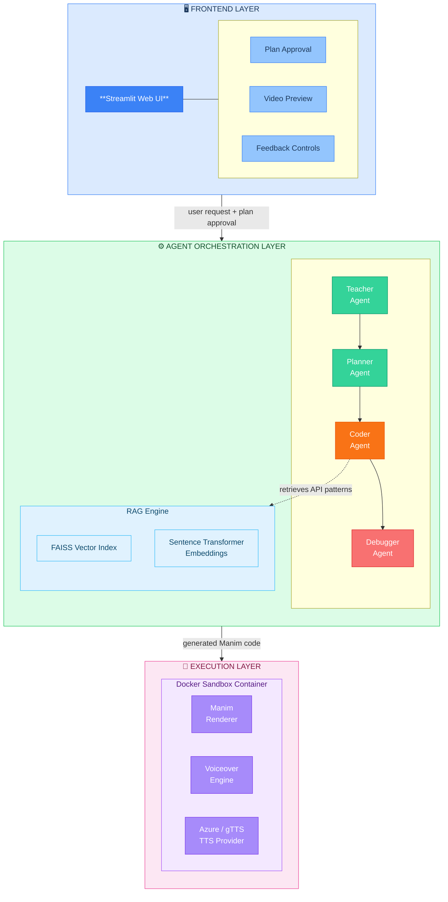

### 2.2 System Requirements

#### 2.2.1 Hardware Requirements

| Component | Minimum Requirement | Recommended |
|-----------|-------------------|-------------|
| Processor | Intel Core i5 / AMD Ryzen 5 | Intel Core i7 / AMD Ryzen 7 |
| RAM | 8 GB | 16 GB |
| Storage | 10 GB free space | 20 GB SSD |
| Network | Broadband internet (for Gemini API & Azure TTS) | High-speed internet |
| GPU | Not required (CPU rendering) | NVIDIA GPU (for faster Manim rendering) |

#### 2.2.2 Software Requirements

| Software | Requirement |
|----------|-------------|
| Operating System | Windows 10/11, macOS 12+, or Ubuntu 20.04+ |
| Python | 3.10 or higher |
| Docker Desktop | Latest version with WSL2 backend (Windows) |
| Web Browser | Chrome, Firefox, or Edge (for Streamlit UI) |
| Git | For version control |

#### 2.2.3 API Keys & Credentials

| Service | Required | Purpose |
|---------|----------|---------|
| Google Gemini API Key (`GEMINI_API_KEY`) | **Yes** | All LLM operations |
| Azure Speech Key (`AZURE_SUBSCRIPTION_KEY`) | Optional | High-quality TTS |
| Azure Speech Region (`AZURE_SERVICE_REGION`) | Optional | Azure TTS region endpoint |

---

## CHAPTER 3: FUNCTIONAL REQUIREMENTS

### 3.1 Teacher Agent Functions

#### 3.1.1 Pedagogical Curriculum Design

The Teacher Agent acts as an expert curriculum designer. Given any topic, it generates a structured pedagogical explanation that includes:

- **Core Idea** — The fundamental concept distilled into one clear sentence.
- **Prerequisites** — What the learner should already know before this topic.
- **Real-World Analogy** — An intuitive analogy connecting the concept to everyday experience.
- **Key Steps** — A sequential breakdown of the concept into digestible learning steps.
- **Common Misconceptions** — Pitfalls that learners typically encounter.

#### 3.1.2 Intent Classification

The Intent Classifier module (`intent.py`) determines whether a user query is:

- **Bare Topic** — A simple topic name (e.g., "RNN", "Gradient Descent") requiring full pedagogical treatment.
- **Detailed** — A specific instruction or question (e.g., "explain how attention works in transformers") requiring targeted response.

Classification rules:
- Queries with ≤ 8 words, no instruction verbs, and no sentence punctuation → `bare_topic`.
- All other queries → `detailed`.

#### 3.1.3 5-Beat Learning Arc Generation

For bare-topic queries, the Teacher generates a structured 5-beat learning arc:

1. **Hook** — Why should the learner care about this topic?
2. **Foundation** — The simplest prerequisite concept.
3. **Build** — Layer complexity one step at a time.
4. **AHA Moment** — The visual that makes the concept "click".
5. **Reinforce** — Before/after comparison and summary.

### 3.2 Planner Agent Functions

#### 3.2.1 Animation Plan Generation

The Planner Agent converts the Teacher's pedagogical explanation into a concrete, structured JSON animation plan containing:

- `title` — Video title.
- `visual_style` — Primary visual style (diagram, graph, flowchart, etc.).
- `visual_metaphor` — Core visual analogy for the concept.
- `duration_seconds` — Target video duration (45-90 seconds).
- `segments` — Array of 5 video segments with detailed step descriptions.
- `pedagogical_arc` — Hook, foundation, build, aha_moment, reinforce.
- `emotional_beats` — Target emotional progression (curious → confident).
- `opening_scene` / `closing_scene` — Specific instructions for intro and outro.

#### 3.2.2 5-Segment Video Structure

Every generated video follows a strict 5-segment structure:

| Segment | Type | Content | Duration |
|---------|------|---------|----------|
| 1 | `introduction` | Topic Name → Definition → Use/Need | 8-12s |
| 2 | `theory_analogy` | Split-screen: Theory (left) vs. Analogy (right) | 12-18s |
| 3 | `core_animation` | Main visual demonstration with AHA moment | 15-25s |
| 4 | `user_message` | Direct answer to the user's prompt | 8-12s |
| 5 | `summary` | Green banner with key takeaway | 6-10s |

#### 3.2.3 Topic Visual Hints Integration

The system maintains a curated library of topic-specific visual hints for common ML/AI topics. These hints include:

- Preferred visual metaphors (e.g., "conveyor belt" for LSTM cell state).
- Recommended color schemes for different components.
- Layout patterns for specific diagram types.
- Known pitfalls to avoid for each topic.

### 3.3 Coder Agent Functions

#### 3.3.1 Manim Code Generation

The Coder Agent generates complete, executable Manim Python code from the Planner's JSON plan. The generated code:

- Uses `VoiceoverScene` as the base class with Azure/gTTS speech service.
- Contains all 5 segments with proper cleanup between them.
- Includes voiceover blocks with synchronized on-screen text.
- Uses fixed coordinate constants for layout management.
- Follows strict safe-zone boundaries (x: [-6.5, 6.5], y: [-3.5, 3.5]).

#### 3.3.2 RAG-Enhanced API Retrieval

Before code generation, the system retrieves relevant Manim API patterns from a pre-built FAISS vector index:

- **Embedding Model:** `all-MiniLM-L6-v2` (Sentence Transformers).
- **Index:** Pre-built from Manim Community Edition documentation.
- **Top-K Retrieval:** 3 most relevant API patterns injected into the prompt.
- **Purpose:** Reduces LLM hallucination by providing ground-truth API references.

#### 3.3.3 Code Validation & Preventive Fixes

The Coder Agent performs 11 validation checks on generated code:

1. **Scene class presence** — `class GeneratedScene(VoiceoverScene)`
2. **Construct method** — `def construct(self)`
3. **Speech service setup** — `self.set_speech_service()`
4. **Voiceover blocks** — `with self.voiceover()`
5. **Sandbox constraints** — No `ImageMobject`, `SVGMobject`, or `.to_center()`
6. **Truncation detection** — Code doesn't end mid-expression
7. **Scene cleanup** — Adequate `FadeOut` calls between segments
8. **Voice-text sync** — Text built before voiceover blocks
9. **Timing budget** — `tracker.duration` fractions sum ≤ 0.95
10. **Color constants** — No invalid suffix variants (e.g., `ORANGE_E`)
11. **Hallucinated APIs** — No `SurroundingRoundedRectangle`, `Text.set_text()`

Preventive substitutions are applied automatically, including:
- Stripping voiceover bookmarks (GTTSService incompatibility).
- Converting `Rectangle(corner_radius=X)` → `RoundedRectangle(corner_radius=X)`.
- Replacing bare `opacity=` with `stroke_opacity=` / `fill_opacity=`.
- Guarding `tracker.get_remaining_duration()` against negative values.

#### 3.3.4 Truncation Recovery

When LLM output is truncated due to token limits (`MAX_TOKENS` finish reason), the system:

1. Detects truncation via `_likely_truncated_tail()`.
2. Sends a continuation prompt with the last 60 lines for context.
3. Stitches the continuation to the base code.
4. Repeats up to 2 continuation hops.

### 3.4 Debugger Agent Functions

#### 3.4.1 Deterministic Runtime Fixes

The Debugger applies **zero-LLM-cost** fixes for 20+ known Manim runtime errors:

| Error Pattern | Automatic Fix |
|--------------|---------------|
| `obj.center` used as property | → `obj.get_center()` |
| `SurroundingRoundedRectangle` | → `SurroundingRectangle` |
| `opacity=` in constructors | → `stroke_opacity=` / `fill_opacity=` |
| `axes.get_graph()` (deprecated) | → `axes.plot()` |
| `bookmark` tags (GTTSService crash) | Strip all bookmark tags |
| `Text(alignment=...)` | Strip invalid kwarg |
| `set_camera_orientation()` | Remove (VoiceoverScene incompatible) |
| `Rectangle(corner_radius=X)` | → `RoundedRectangle(corner_radius=X)` |
| `tracker.get_remaining_duration() ≤ 0` | → `max(0.05, ...)` guard |
| `ORANGE_E` (undefined) | → `ORANGE` |

#### 3.4.2 LLM-Assisted Debugging

When deterministic fixes fail, the Debugger sends the broken code + error message to Gemini with:

- The full error traceback.
- RAG-retrieved Manim API context relevant to the error.
- Strict instructions to fix only the failing line/block (surgical fix, not rewrite).
- A sanity check ensuring the fixed code is not drastically shorter than the original.

### 3.5 Voice Engine Functions

#### 3.5.1 Azure Speech Integration

- Uses Azure Cognitive Services Speech SDK.
- Voice: Configurable via `AZURE_TTS_VOICE` (default: `en-IN-NeerjaNeural`).
- Output: 48kHz 192kbps Mono MP3.
- Rendered directly inside Manim voiceover blocks.

#### 3.5.2 gTTS Fallback

- Automatic fallback when Azure fails or is not configured.
- Uses Google Text-to-Speech (gTTS) library.
- Configured via `TTS_PROVIDER` and `TTS_FALLBACK_PROVIDER` environment variables.
- Generated code includes try/except blocks for runtime fallback.

#### 3.5.3 Voice-Text Synchronization

Strict synchronization rules enforced by the Coder Agent:

1. **Text-First Pattern** — All text/paragraph objects must be built and displayed BEFORE entering the voiceover block.
2. **Content Matching** — On-screen text must be ~90% literal match of voiceover narration (for theory/summary segments).
3. **No Slow Text Inside Voice** — `Write()` and `Create()` animations for text are forbidden inside voiceover blocks.

### 3.6 Sandbox Functions

#### 3.6.1 Docker-Based Isolated Execution

- Runs generated code inside a Docker container (`manim-voiceover` image).
- Only `scene.py` is mounted — no access to host filesystem.
- Environment variables for TTS are forwarded securely.
- Timeout protection: 300 seconds (default), extendable to 900 seconds.
- Video discovery: Automatically finds the best final render, avoiding partial movie fragments.

#### 3.6.2 Failure Logging & Analysis

Every compilation failure is logged with:

- **Timestamped JSON bundle** — Full code, error, query, attempt number, tags.
- **JSONL index** — One-line summaries for fast grep/scan.
- **Legacy flat files** — `last_failed_scene.py` and `last_failed_log.txt`.
- **Tag extraction** — Automatic categorization (bookmark, TypeError, timeout, etc.).
- **CLI Viewer** — `failure_log_viewer.py` provides summary, tag frequency, and bundle inspection.

### 3.7 User Interface Functions

#### 3.7.1 Plan Generation & Approval

- User enters a topic or question in the Streamlit text input.
- System generates a structured animation plan.
- Plan is displayed as an editable JSON for review.
- User can approve, modify, or regenerate the plan.

#### 3.7.2 Video Generation & Preview

- After plan approval, the system generates Manim code and compiles it.
- Progress is shown via a Streamlit progress bar with status messages.
- Generated video is displayed in an embedded player.
- Code is shown in an expandable section for inspection.

#### 3.7.3 Feedback Learning System

- Users can give thumbs-up to successful animations.
- Approved code is saved as a few-shot example for future generations.
- Examples are categorized by visual style (diagram, graph, flowchart).
- Highest-rated examples are injected into future Coder prompts.

#### 3.7.4 Revision & Iteration

- Users can request changes to existing animations.
- The Coder Agent applies surgical modifications while preserving working code.
- Revised code goes through the same compilation + debug loop.

---

## CHAPTER 4: NON-FUNCTIONAL REQUIREMENTS

### 4.1 Usability

- **Natural Language Input** — Users describe topics in plain English; no coding knowledge required.
- **Interactive Plan Review** — Users can approve, modify, or regenerate animation plans.
- **Streamlit Web UI** — Clean, intuitive browser-based interface accessible on any device.
- **One-Click Generation** — Single button click from approved plan to final video.

### 4.2 Reliability

- **Self-Healing Pipeline** — Automatic retry up to 3 attempts with deterministic + LLM fixes.
- **TTS Failover** — Azure → gTTS automatic fallback ensures voice always works.
- **Graceful Degradation** — Individual component failures (RAG, feedback) don't crash the pipeline.
- **Failure Logging** — Every failure is persisted for post-hoc analysis and system improvement.

### 4.3 Performance

- **End-to-End Time** — Typical video generation: 2-5 minutes (including LLM calls and rendering).
- **Token Efficiency** — Deterministic fixes eliminate unnecessary LLM calls for known errors.
- **RAG Retrieval** — Sub-second FAISS vector search for API pattern matching.
- **Caching** — RAG index and embedding model loaded once at startup.

### 4.4 Security

- **Docker Sandboxing** — AI-generated code executes in isolated containers with no host access.
- **No Filesystem Operations** — Generated code cannot read/write host files.
- **API Key Management** — Credentials stored in `.env` files, never hardcoded.
- **Input Sanitization** — User queries are sanitized before injection into LLM prompts.

### 4.5 Scalability

- **Model-Agnostic Architecture** — System discovers available Gemini models dynamically.
- **Fallback Chain** — Automatic model fallback: preferred → gemini-2.5-flash → gemini-2.5-flash-lite.
- **Pluggable TTS** — New TTS providers can be added without modifying the core pipeline.
- **Extensible Agent System** — New agents can be added to the orchestrator chain.

### 4.6 Maintainability

- **Modular Architecture** — Each agent is a standalone Python module with clear interfaces.
- **Comprehensive Logging** — Every pipeline stage prints tagged status messages.
- **Failure Analytics** — CLI viewer for failure log analysis with tag frequency and filtering.
- **Code Validators** — 11 automated validators catch common issues before compilation.

---

## CHAPTER 5: SYSTEM DESIGN

### 5.1 System Architecture Diagram

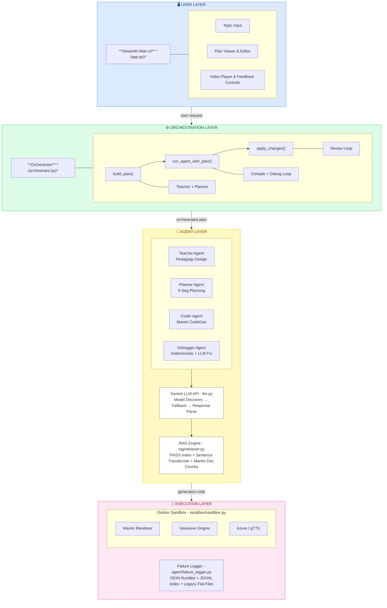


### 5.2 Multi-Agent Pipeline Diagram

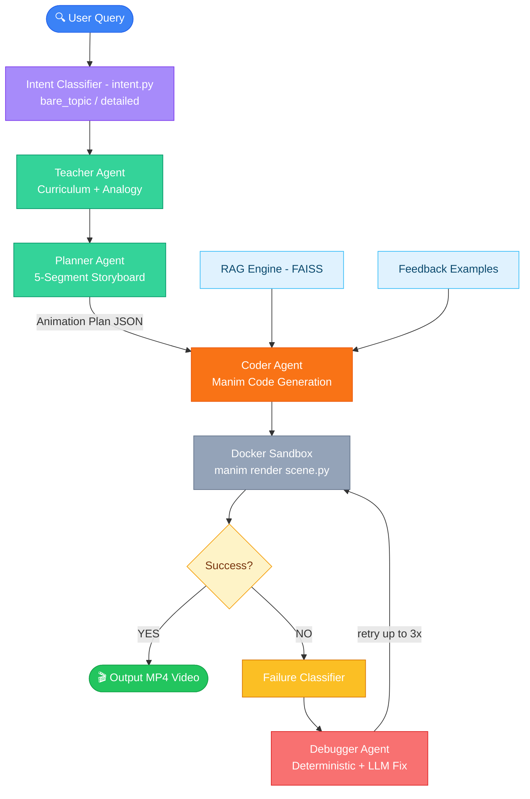


### 5.3 Use-Case Diagrams

#### 5.3.1 User Use-Case Diagram

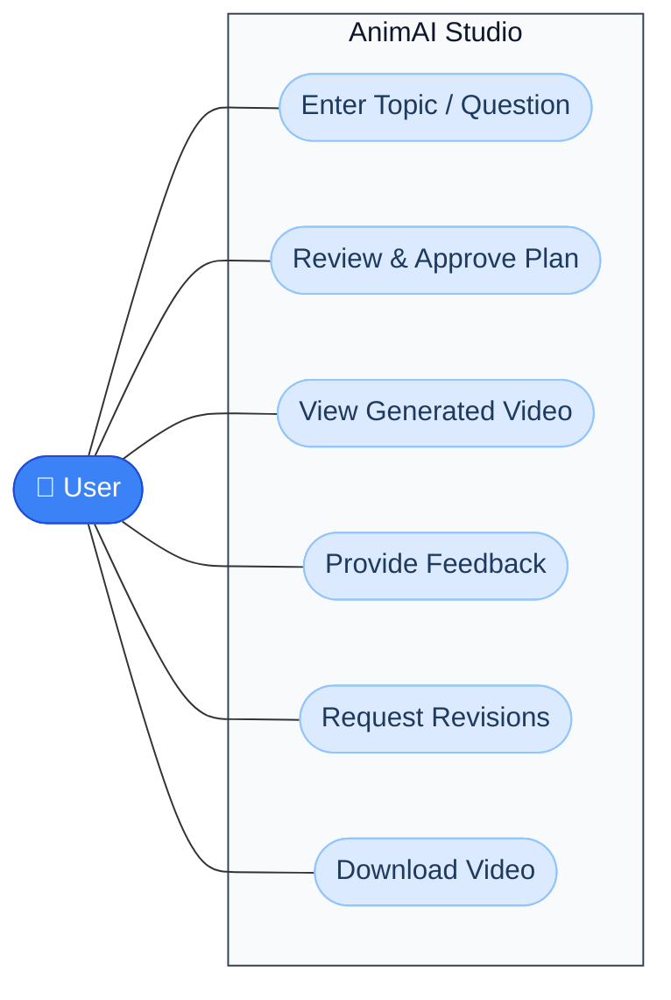

#### 5.3.2 System Use-Case Diagram

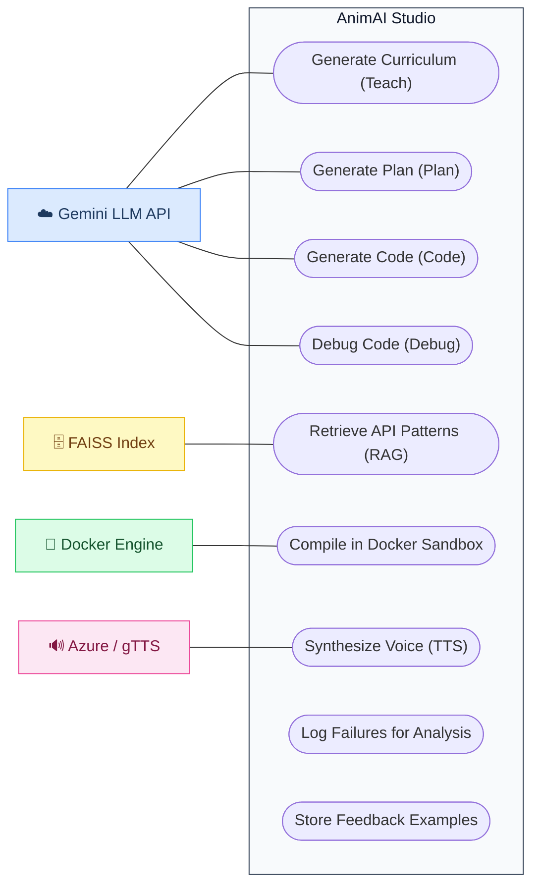

### 5.4 Entity-Relationship Diagram

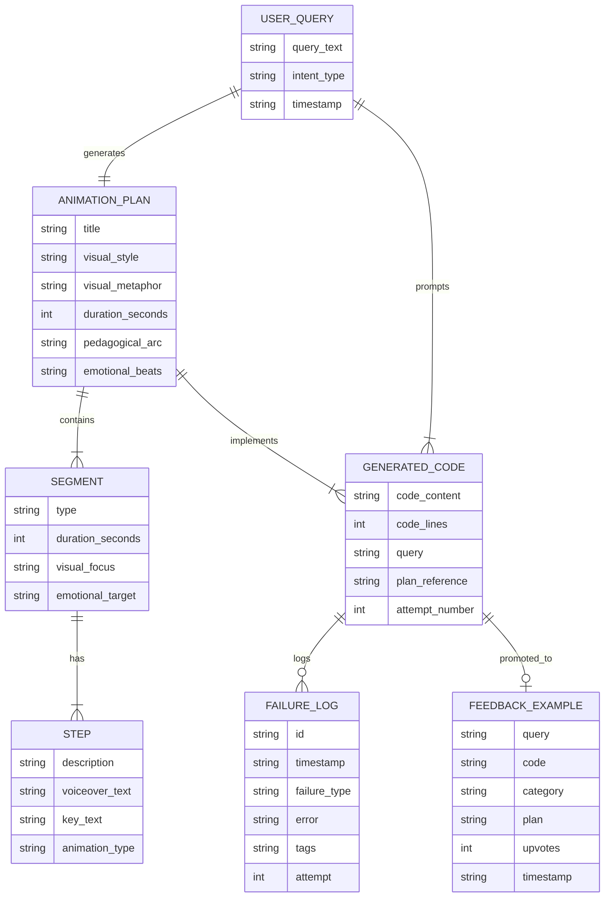

### 5.5 Data Flow Diagram

**Level 0 — Context Diagram**

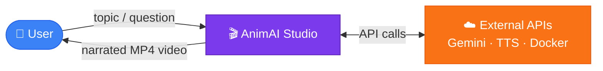

**Level 1 — Process Decomposition**

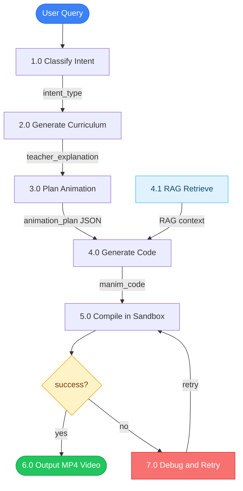

---

## CHAPTER 6: FUNCTIONAL FLOW CONTROL

### 6.1 Video Generation Flow

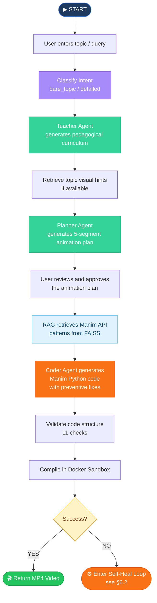

### 6.2 Self-Healing Compilation Loop

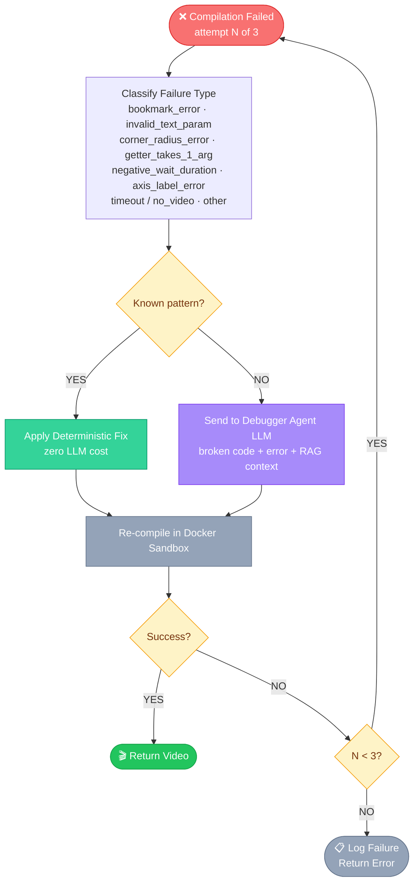

### 6.3 Revision Flow

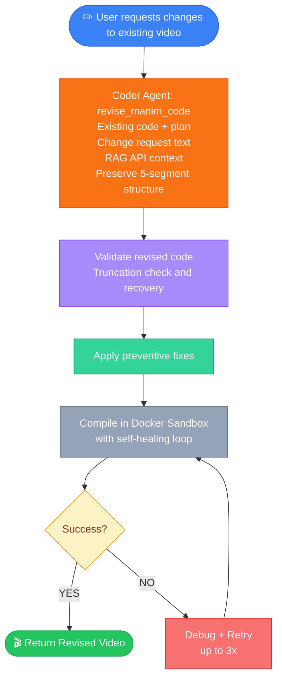

---

## CHAPTER 7: APPLICATION SCREENSHOTS

> **Note:** Screenshots should be captured from a running instance of the application. Below are descriptions of the key screens that should be included:

### Screenshot 1: Landing Page
The Streamlit interface showing the AnimAI Studio title, sidebar with generation history, and the main topic input area. The interface features a dark-themed design with the project branding.

### Screenshot 2: Topic Input
User entering a topic (e.g., "Gradient Descent") in the text input field. The interface shows the "Generate Plan" button and any existing session history in the sidebar.

### Screenshot 3: Plan Generation
The generated animation plan displayed as structured content showing:
- Video title and visual style
- 5 segments with types and durations
- Pedagogical arc (hook → aha moment → reinforce)
- "Approve Plan" and "Regenerate" buttons

### Screenshot 4: Video Generation Progress
The progress bar showing the pipeline stages:
- "Generating Manim code..."
- "Compiling in Docker sandbox..."
- "Attempt 1/3..."
- Real-time status updates from the orchestrator

### Screenshot 5: Generated Video Preview
The completed video displayed in Streamlit's embedded video player with:
- Playback controls (play, pause, seek)
- Video metadata (duration, resolution)
- Expandable code section showing the generated Manim code
- Thumbs-up button for feedback

### Screenshot 6: Generated Animation Frame — Introduction Segment
A frame from the rendered video showing:
- Topic title with underline
- Definition text
- Dark background (#0F0F1A)
- Clean typography

### Screenshot 7: Generated Animation Frame — Theory & Analogy
A frame showing the split-screen layout:
- LEFT column: Theory points
- RIGHT column: Real-world analogy
- Divider line between columns
- Color-coded headers

### Screenshot 8: Generated Animation Frame — Core Animation
A frame showing the main visual demonstration:
- Mathematical diagrams or flowcharts
- Animated elements (arrows, highlights)
- Key text panel on the right
- "AHA moment" visual

### Screenshot 9: Generated Animation Frame — Summary Banner
A frame showing the closing summary:
- Green (#0A2A0A) rounded rectangle banner
- Key takeaway text in white
- Final wait screen

### Screenshot 10: Failure Log Viewer
Terminal output of `failure_log_viewer.py` showing:
- Failure summary table
- Tag frequency chart
- Failure type breakdown

### Screenshot 11: Revision Interface
User entering a revision request (e.g., "make the arrows thicker and add more labels") with the existing video visible above.

---

## CHAPTER 8: CONCLUSION

AnimAI Studio successfully demonstrates that the process of creating educational animation videos can be fully automated using a multi-agent AI architecture. The system transforms what traditionally requires hours of manual Manim coding, video editing, and narration recording into a streamlined, minutes-long automated pipeline.

**Key achievements of this project:**

1. **Multi-Agent Pipeline Architecture** — The five-agent design (Teacher → Planner → Coder → Debugger → Voice) mirrors a real-world film production team, with each agent specializing in one aspect of content creation. This modular approach enables independent improvement of each stage.

2. **Self-Healing Code Generation** — The system's ability to automatically detect, classify, and repair 20+ categories of Manim compilation errors — both through zero-cost deterministic fixes and LLM-assisted debugging — achieves a significantly higher first-attempt compilation rate than naive code generation.

3. **Pedagogical Structure Enforcement** — Unlike generic video generators, AnimAI Studio enforces educational best practices through its 5-segment learning arc, voice-text synchronization rules, and structured curriculum design. Every video follows a consistent pedagogical pattern that has been refined through iterative testing.

4. **RAG-Enhanced Quality** — By retrieving ground-truth Manim API patterns from a FAISS-indexed documentation corpus, the system significantly reduces LLM hallucination of non-existent API methods and parameters.

5. **Production-Ready Security** — Docker-based sandboxed execution ensures that AI-generated code cannot access or modify the host system, making the tool safe for deployment in educational institutions.

6. **Continuous Improvement** — The feedback learning system enables the quality of generated animations to improve over time as users approve high-quality outputs, creating a positive feedback loop.

The project validates the feasibility of applying multi-agent LLM systems to creative content generation tasks that require both technical precision (correct Manim API usage) and domain expertise (educational pedagogy).

---

## CHAPTER 9: FUTURE SCOPE

1. **Multi-Language Support** — Extend voice narration to support multiple languages (Hindi, Spanish, French, etc.) by leveraging Azure Speech's multilingual voices. On-screen text would be translated via LLM-based translation.

2. **Interactive Animations** — Generate Manim Interactive Scenes that allow viewers to manipulate parameters (e.g., change learning rate in gradient descent) and see the animation update in real-time.

3. **Batch Processing** — Enable generation of entire course modules (5-10 videos) from a single curriculum description, with consistent visual styles and cross-video references.

4. **Custom Branding** — Allow users to configure institutional branding (logos, color schemes, intro/outro templates) that are applied automatically to all generated videos.

5. **Fine-Tuned Models** — Train a specialized Manim-coding model by fine-tuning on a curated dataset of successful Manim code generations, reducing reliance on general-purpose LLMs and improving compilation rates.

6. **Real-Time Streaming** — Implement real-time video streaming using WebGL-based Manim rendering, eliminating the Docker compilation step for preview purposes.

7. **Assessment Integration** — Automatically generate quiz questions and practice problems based on the video content, creating complete learning modules.

8. **Collaborative Editing** — Multi-user plan editing and review with real-time collaboration features.

9. **Analytics Dashboard** — Track generation success rates, common failure patterns, and user engagement metrics to inform system improvements.

10. **Plugin Architecture** — Enable third-party developers to add custom animation templates, visual styles, and domain-specific topic hint libraries.

---

## CHAPTER 10: LIMITATIONS

1. **Internet Dependency** — The system requires a stable internet connection for Gemini API calls and Azure Speech TTS. Offline operation is not supported.

2. **API Cost** — Each video generation consumes Gemini API tokens (typically 15,000-30,000 tokens per video). High-volume usage requires a paid API plan.

3. **Rendering Time** — Docker-based Manim rendering takes 2-5 minutes per video, including TTS synthesis. Real-time generation is not feasible with the current architecture.

4. **LLM Hallucination** — Despite RAG and 11 validators, the LLM can still occasionally generate incorrect Manim code that passes validation but produces visually incorrect results (e.g., mispositioned elements, wrong colors).

5. **Limited Visual Complexity** — The system generates 2D animations only. Three-dimensional visualizations, particle effects, and complex physics simulations are beyond the current scope.

6. **Single Scene Architecture** — Each video uses a single Manim `Scene`, limiting the complexity of multi-scene compositions.

7. **TTS Quality Variation** — gTTS fallback produces noticeably lower quality narration compared to Azure Neural voices. The quality gap is visible in prosody and naturalness.

8. **Docker Requirement** — The Docker runtime dependency adds complexity to local setup and is not available on all platforms (e.g., some cloud-hosted IDEs).

9. **Topic Coverage** — While the system can generate videos on any topic, it performs best on STEM subjects (mathematics, computer science, machine learning) where Manim's strengths align. Non-visual topics may produce less engaging results.

10. **No Video Editing** — The system generates complete videos in one pass. There is no frame-level editing, scene reordering, or clip-based post-production capability.

---

## CHAPTER 11: BIBLIOGRAPHY

1. **Manim Community Edition** — *Manim Community Developers* (2023). "Manim — Mathematical Animation Framework." Available at: https://www.manim.community/

2. **Google Gemini API** — *Google DeepMind* (2024). "Gemini API Documentation." Available at: https://ai.google.dev/

3. **FAISS** — Johnson, J., Douze, M., & Jégou, H. (2019). "Billion-scale similarity search with GPUs." *IEEE Transactions on Big Data*, 7(3), 535-547. Available at: https://github.com/facebookresearch/faiss

4. **Sentence Transformers** — Reimers, N., & Gurevych, I. (2019). "Sentence-BERT: Sentence Embeddings using Siamese BERT-Networks." *Proceedings of the 2019 Conference on Empirical Methods in Natural Language Processing*. Available at: https://www.sbert.net/

5. **Streamlit** — *Streamlit Inc.* (2024). "Streamlit Documentation." Available at: https://docs.streamlit.io/

6. **Azure Cognitive Services Speech** — *Microsoft* (2024). "Azure Speech Service Documentation." Available at: https://learn.microsoft.com/en-us/azure/ai-services/speech-service/

7. **gTTS** — *Pierre Nicolas Durette* (2024). "gTTS — Google Text-to-Speech." Available at: https://github.com/pndurette/gTTS

8. **Docker** — *Docker Inc.* (2024). "Docker Documentation." Available at: https://docs.docker.com/

9. **Retrieval-Augmented Generation (RAG)** — Lewis, P., et al. (2020). "Retrieval-Augmented Generation for Knowledge-Intensive NLP Tasks." *Advances in Neural Information Processing Systems*, 33, 9459-9474.

10. **Multi-Agent Systems** — Wooldridge, M. (2009). *An Introduction to MultiAgent Systems* (2nd ed.). John Wiley & Sons.

11. **Manim Voiceover** — *Manim Community* (2023). "Manim Voiceover Plugin." Available at: https://github.com/ManimCommunity/manim-voiceover

12. **LLM Code Generation** — Chen, M., et al. (2021). "Evaluating Large Language Models Trained on Code." *arXiv preprint arXiv:2107.03374*.

13. **Educational Video Design** — Mayer, R. E. (2009). *Multimedia Learning* (2nd ed.). Cambridge University Press.

14. **Self-Healing Systems** — Ghosh, D., Sharman, R., Rao, H. R., & Upadhyaya, S. (2007). "Self-healing systems — survey and synthesis." *Decision Support Systems*, 42(4), 2164-2185.

---

## PROJECT DIRECTORY STRUCTURE

```
animai-studio/
├── app.py                          # Streamlit web interface (main entry point)
├── Dockerfile                      # Docker image definition for Manim sandbox
├── requirements.txt                # Python package dependencies
├── README.md                       # Project overview and setup guide
├── PROJECT_REPORT.md               # This report
├── failure_log_viewer.py           # CLI failure analysis dashboard
├── .env                            # Environment variables (API keys)
├── .gitignore                      # Git ignore rules
│
├── agent/                          # Multi-agent AI pipeline
│   ├── __init__.py                 # Package init
│   ├── orchestrator.py             # Central pipeline controller
│   ├── teacher.py                  # Pedagogical curriculum designer
│   ├── planner.py                  # Animation plan generator
│   ├── coder.py                    # Manim code generator + validators
│   ├── debugger.py                 # Compilation error fixer
│   ├── llm.py                      # Gemini API interface with model discovery
│   ├── intent.py                   # Query intent classifier
│   ├── feedback.py                 # Feedback learning system
│   ├── validator.py                # Post-generation structure validator
│   ├── failure_logger.py           # Persistent failure logging
│   └── topic_hints.py              # Topic-specific visual hint library
│
├── sandbox/                        # Isolated code execution
│   ├── __init__.py                 # Package init
│   └── sandbox.py                  # Docker-based Manim sandbox runner
│
├── rag/                            # Retrieval-Augmented Generation
│   ├── __init__.py                 # Package init
│   ├── retriever.py                # FAISS-based document retriever
│   ├── download_docs.py            # Documentation indexing script
│   ├── manim_docs.index            # Pre-built FAISS search index
│   └── manim_chunks.json           # Indexed documentation chunks
│
├── scripts/                        # Headless test/demo runners
│   ├── _run_gradient_descent.py    # Gradient descent video runner
│   ├── _run_lstm.py                # LSTM video runner
│   ├── _run_project_showcase.py    # Project showcase video runner
│   ├── _run_two_videos.py          # Dual video batch runner
│   ├── _run_fixed_showcase.py      # Fixed showcase scene runner
│   └── run_success.py              # Re-run last success runner
│
├── outputs/                        # Generated artifacts (gitignored)
│   ├── animation.mp4               # Latest generated video
│   ├── last_success_scene.py       # Last successfully compiled code
│   ├── last_failed_scene.py        # Last failed scene code
│   ├── last_failed_log.txt         # Last failure error log
│   └── failure_logs/               # Timestamped failure bundles
│       ├── index.jsonl             # Failure index (one-liner summaries)
│       └── *.json                  # Full failure bundles
│
└── data/                           # Learning data (gitignored)
    └── feedback_examples.json      # User-approved few-shot examples
```

---

*Report generated for AnimAI Studio v1.0*
*Date: April 2026*
