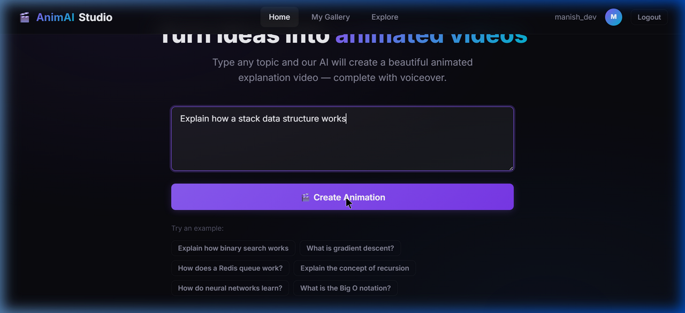
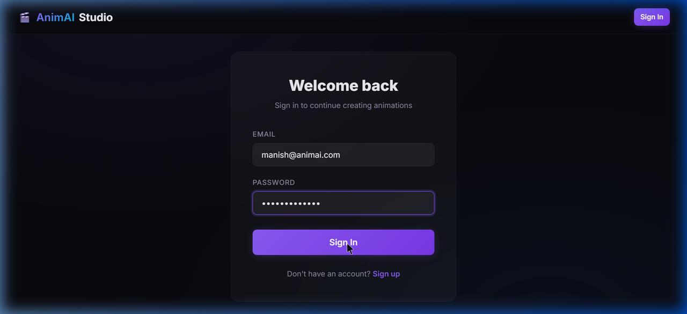
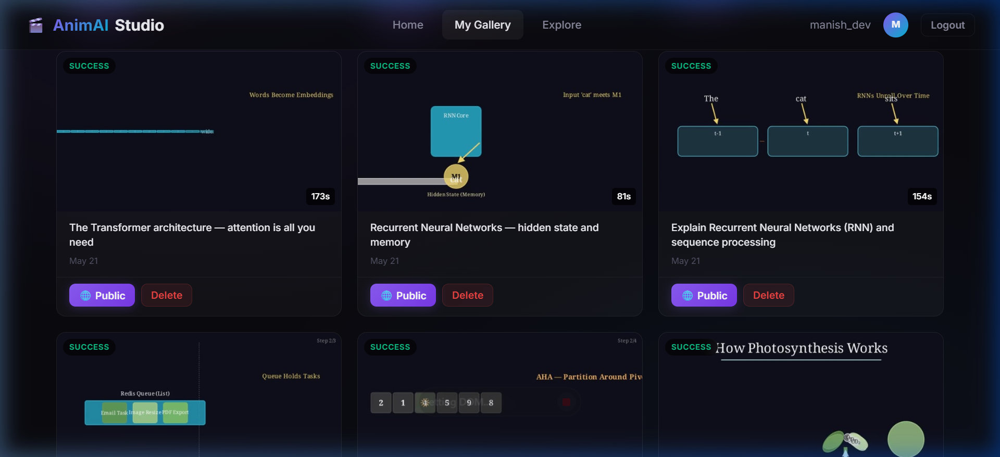
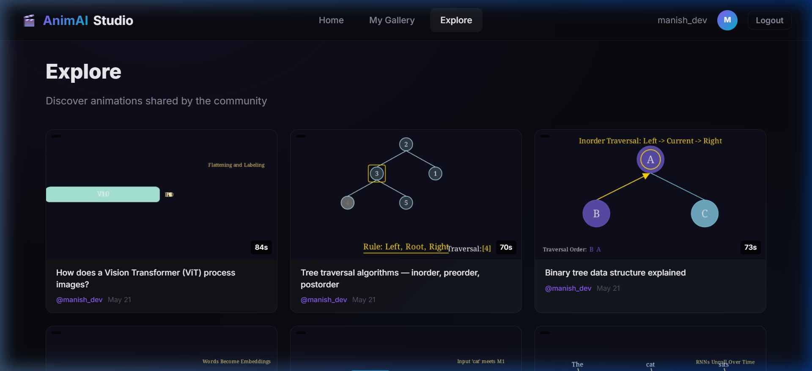

<p align="center">
  <h1 align="center">🎬 AnimAI Studio</h1>
  <p align="center">
    <strong>AI-powered animated video generation platform</strong><br/>
    Turn any concept into a beautiful, narrated Manim animation — in seconds.
  </p>
  <p align="center">
    
    
    
    
    
    
    
    
  </p>
</p>

---

## 📸 Screenshots

<table>
  <tr>
    <td><br/><sub>Home — Prompt input with examples</sub></td>
    <td><br/><sub>Auth — Login with JWT</sub></td>
  </tr>
  <tr>
    <td><br/><sub>Gallery — User's animations</sub></td>
    <td><br/><sub>Explore — Community gallery</sub></td>
  </tr>
</table>

---

## 🏗️ Architecture

```
┌─────────────┐     ┌──────────────────┐     ┌───────────────┐
│   React     │────▶│  Express API     │────▶│  FastAPI +    │
│   (Vite)    │ WS  │  + Socket.io     │ HTTP│  Manim Render │
│   :5173     │◀────│  + BullMQ Worker │◀────│  :8000        │
└─────────────┘     └────────┬─────────┘     └───────────────┘
                             │
              ┌──────────────┼──────────────┐
              ▼              ▼              ▼
        ┌──────────┐  ┌──────────┐  ┌──────────────┐
        │  Redis   │  │ MongoDB  │  │  Cloudinary  │
        │  Queue   │  │  Atlas   │  │  CDN         │
        │  :6379   │  │  (Cloud) │  │  (Cloud)     │
        └──────────┘  └──────────┘  └──────────────┘
```

### Data Flow

1. **User** types a prompt → React creates an animation via `POST /api/animations`
2. **Generate** button → `POST /api/animations/generate` → BullMQ queues the job
3. **Worker** picks up the job → calls Python FastAPI → Manim renders the video
4. **Cloudinary** receives the `.mp4` → returns CDN URL + auto-thumbnail
5. **Socket.io** pushes real-time progress events to the React client
6. **Video** plays in the Studio page from Cloudinary edge servers worldwide

---

## 🛠️ Tech Stack

| Layer | Technology | Purpose |
|-------|-----------|---------|
| **Frontend** | React 18 + Vite | SPA with routing, auth context, WebSocket hook |
| **API** | Express.js + Node 22 | REST API, JWT auth, middleware |
| **Real-time** | Socket.io | Push progress events (planning → generating → uploading) |
| **Queue** | BullMQ + Redis | Async job processing for video generation |
| **AI/Render** | Python + Manim CE | LLM generates code → Manim renders animation video |
| **CDN** | Cloudinary | Video hosting, auto-thumbnails, global delivery |
| **Database** | MongoDB Atlas | User accounts, animation metadata, plans |
| **Auth** | JWT + bcrypt | Stateless authentication with 7-day expiry |
| **DevOps** | Docker Compose | One-command deployment of all services |

---

## 🚀 Quick Start

### Prerequisites

- [Node.js 22+](https://nodejs.org)
- [Docker Desktop](https://www.docker.com/products/docker-desktop) (for Redis + Manim)
- [MongoDB Atlas](https://www.mongodb.com/atlas) account (free tier)
- [Cloudinary](https://cloudinary.com) account (free tier)
- [Google AI](https://aistudio.google.com) API key (for Gemini)

### 1. Clone & Setup

```bash
git clone https://github.com/Manish-Sharma26/AnimAi.git
cd AnimAi
```

### 2. Environment Variables

Create `server/.env`:

```env
# MongoDB
MONGO_URI=mongodb+srv://<user>:<pass>@cluster.mongodb.net/animai

# JWT
JWT_SECRET=your-secret-key
JWT_EXPIRES_IN=7d

# Redis (Docker handles this)
REDIS_HOST=localhost
REDIS_PORT=6379

# Python AI Service
PYTHON_API_URL=http://localhost:8000

# Cloudinary
CLOUDINARY_CLOUD_NAME=your-cloud-name
CLOUDINARY_API_KEY=your-api-key
CLOUDINARY_API_SECRET=your-api-secret
```

Create root `.env` for Manim/AI:

```env
GEMINI_API_KEY=your-gemini-api-key
```

### 3. Start with Docker Compose (Recommended)

```bash
docker compose up --build
```

This starts: Redis (:6379) → API (:3001) → React (:5173) → Manim (:8000)

### 4. Or Start Manually

```bash
# Terminal 1: Redis
docker run -d --name redis -p 6379:6379 redis:7-alpine

# Terminal 2: Express API
cd server && npm install && npm run dev

# Terminal 3: React Client
cd client && npm install && npm run dev

# Terminal 4: Python/Manim (optional — only for video generation)
cd .. && python -m uvicorn sandbox.sandbox:app --port 8000
```

### 5. Open

Navigate to **http://localhost:5173** — register an account and start creating!

---

## 📁 Project Structure

```
animai-studio/
├── client/                     # React Frontend
│   ├── src/
│   │   ├── components/         # Navbar, AnimationCard, ProgressTracker, VideoPlayer
│   │   ├── context/            # AuthContext (global auth state)
│   │   ├── hooks/              # useSocket (Socket.io connection)
│   │   ├── pages/              # Auth, Home, Studio, Gallery, Explore
│   │   ├── services/           # api.js (Axios + JWT interceptor)
│   │   └── index.css           # Design system (dark theme, glassmorphism)
│   ├── vite.config.js          # Proxy /api + /socket.io → Express
│   └── Dockerfile
│
├── server/                     # Express Backend
│   ├── src/
│   │   ├── config/             # env.js, db.js, redis.js
│   │   ├── controllers/        # auth, animation (CRUD + generate + share)
│   │   ├── middleware/          # JWT auth, error handler
│   │   ├── models/             # User, Animation, Feedback (Mongoose)
│   │   ├── routes/             # RESTful route definitions
│   │   ├── services/           # queue (BullMQ worker), cloudinary, pythonBridge
│   │   ├── sockets/            # Socket.io init + progress emitter
│   │   └── index.js            # Express + Socket.io server entry
│   ├── scripts/                # seed-gallery.js
│   └── Dockerfile
│
├── sandbox/                    # Python Manim Sandbox
│   └── sandbox.py              # FastAPI server + Docker Manim execution
│
├── agent/                      # AI Agent Pipeline
│   ├── orchestrator.py         # Multi-agent coordination
│   ├── coder.py                # Manim code generation (Gemini)
│   ├── planner.py              # Animation plan generation
│   └── debugger.py             # Auto-fix compilation errors
│
├── docker-compose.yml          # Full stack orchestration
├── Dockerfile.manim            # Manim + FastAPI container
└── README.md
```

---

## 🔌 API Endpoints

### Auth
| Method | Endpoint | Description |
|--------|----------|-------------|
| POST | `/api/auth/register` | Create account |
| POST | `/api/auth/login` | Login → JWT token |
| GET | `/api/auth/me` | Validate token, get user |

### Animations (Protected)
| Method | Endpoint | Description |
|--------|----------|-------------|
| POST | `/api/animations` | Create animation with prompt |
| GET | `/api/animations` | List user's animations (paginated) |
| GET | `/api/animations/:id` | Get animation details |
| PUT | `/api/animations/:id` | Update plan/status |
| PATCH | `/api/animations/:id/share` | Toggle public/private |
| DELETE | `/api/animations/:id` | Delete (+ Cloudinary cleanup) |
| POST | `/api/animations/generate` | Queue video generation job |
| GET | `/api/animations/jobs/:jobId` | Poll job status |

### Public
| Method | Endpoint | Description |
|--------|----------|-------------|
| GET | `/api/gallery` | Community gallery (no auth) |
| GET | `/api/health` | Server health check |

### WebSocket Events
| Event | Direction | Data |
|-------|-----------|------|
| `job:progress` | Server → Client | `{ animationId, step, percent }` |
| `job:complete` | Server → Client | `{ animationId, videoUrl, thumbnailUrl }` |
| `job:failed` | Server → Client | `{ animationId, error }` |

---

## 🎯 Key Engineering Decisions

<details>
<summary><strong>Why BullMQ + Redis instead of in-process?</strong></summary>

Video generation takes 30-120 seconds. Processing it in the Express request handler would block the event loop and hang all other requests. BullMQ runs a separate worker that processes jobs asynchronously, keeping the API responsive. Redis provides persistence — jobs survive server restarts.
</details>

<details>
<summary><strong>Why Cloudinary instead of serving videos from Express?</strong></summary>

Serving large video files from Express would block the event loop (Node.js is single-threaded). Cloudinary delivers videos from 200+ edge servers worldwide with auto-transcoding, adaptive bitrate, and auto-generated thumbnails. The free tier includes 25GB storage and 25GB bandwidth/month.
</details>

<details>
<summary><strong>Why Socket.io instead of polling?</strong></summary>

Polling `/api/jobs/:id` every 2 seconds wastes bandwidth and creates unnecessary load. Socket.io pushes events instantly when the worker reaches each stage. It falls back to HTTP long-polling if WebSocket isn't available. JWT auth in the handshake ensures only authenticated users receive events.
</details>

<details>
<summary><strong>Why separate Express + FastAPI?</strong></summary>

Express handles auth, CRUD, and WebSockets well but can't run Python/Manim. FastAPI handles the AI pipeline (Gemini LLM calls + Manim rendering). They communicate via HTTP. This separation means we can scale them independently — 1 API server can fan out to multiple Manim workers.
</details>

---

## 👤 Author

**Manish Sharma** — [GitHub](https://github.com/Manish-Sharma26)

---

## 📄 License

This project is for educational and portfolio purposes.
