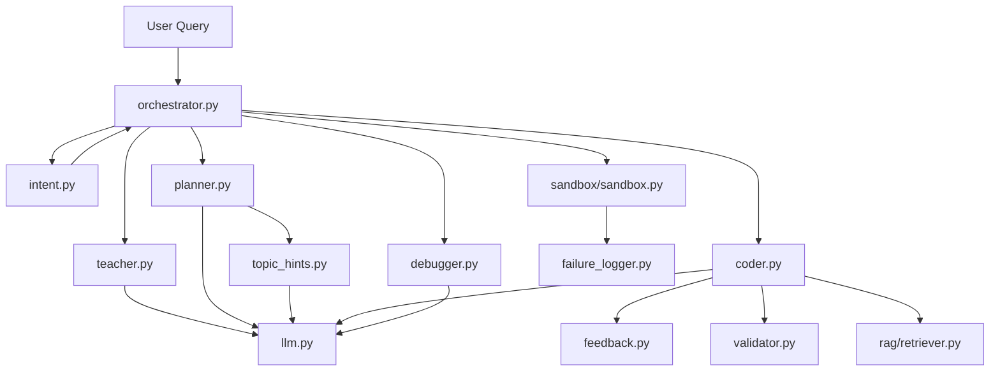

# 🧠 Agent Folder — Complete Deep Dive

> The `agent/` folder is the **AI brain** of AnimAI Studio — a multi-agent pipeline that transforms a user's text query into a fully rendered educational Manim video with voiceover.

---

## 📁 File Map & Architecture



| File | Lines | Role | LLM Calls? |
|------|-------|------|------------|
| `__init__.py` | 1 | Makes `agent/` a Python package | No |
| `llm.py` | 250 | Gemini API wrapper with model fallback | Yes (core) |
| `intent.py` | 225 | Query classifier (rule-based, no LLM) | No |
| `teacher.py` | 476 | Curriculum designer — explains concepts | Yes |
| `planner.py` | 1229 | Animation director — plans video segments | Yes |
| `topic_hints.py` | 803 | Visual style advisor (dynamic + static) | Yes |
| `coder.py` | 2163 | Manim code generator — the largest file | Yes |
| `debugger.py` | 331 | Error fixer for failed Manim renders | Yes |
| `validator.py` | 220 | Post-generation structure checker | No |
| `orchestrator.py` | 408 | Pipeline controller — runs the full flow | No (calls others) |
| `feedback.py` | 95 | Stores user-approved examples for few-shot | No |
| `failure_logger.py` | 186 | Persists failure bundles for analysis | No |

---

## 1️⃣ `llm.py` — The Gemini Gateway

### Purpose
Central wrapper around Google's Gemini API. **Every** agent that needs LLM calls goes through this file.

### Key Components

| Component | What It Does |
|-----------|-------------|
| `client = genai.Client(api_key=...)` | Creates the Gemini client using the API key from `.env` |
| `MODEL_PREFERENCE_ORDER` | Fallback chain: `gemini-2.5-flash` → `gemini-3-flash-preview` → `gemini-2.5-flash-lite` |
| `_discover_generate_content_models()` | Dynamically discovers which models the API key can access |
| `_build_model_candidates()` | Merges user preference + discovered models into an ordered list |
| `call_llm()` | Simple wrapper — returns just the text string |
| `call_llm_detailed()` | Full wrapper — returns `{text, model, finish_reason, candidates_tried, error}` |

### Key Design Decisions

- **Automatic Model Fallback**: If `gemini-2.5-flash` fails (quota/unavailable), it automatically tries the next model. This makes the system resilient to API changes.
- **JSON Validation**: When `response_mime_type="application/json"`, it validates the response is valid JSON before returning. Invalid JSON triggers a retry on the next model.
- **Temperature = 0.2**: Low creativity — we want deterministic, structured outputs (JSON plans, code), not creative prose.
- **Thinking Budget Control**: `disable_thinking=True` skips the model's internal reasoning to save tokens (used by coder/debugger where we want raw code output).

### Interview Q&A

**Q: Why not just call Gemini directly in each agent?**
> Centralization. All retry logic, model fallback, response parsing, and error handling live in one place. If we switch to a different LLM provider, only `llm.py` needs to change.

**Q: What is `finish_reason` and why do you track it?**
> It tells us WHY the model stopped generating. `STOP` = normal completion, `MAX_TOKENS` = output was truncated. The coder uses this to trigger continuation attempts when code is cut off.

**Q: Why discover models dynamically?**
> API key permissions change. A free-tier key might not have access to `gemini-2.5-flash`. Dynamic discovery ensures we always use the best available model.

---

## 2️⃣ `intent.py` — The Query Classifier

### Purpose
Classifies user input into one of **3 tiers** to route it through the correct prompt template. **No LLM call** — purely rule-based for speed.

### Three Tiers

| Tier | Example Input | Route |
|------|--------------|-------|
| `bare_topic` | "RNN", "Gradient Descent" | 5-beat structured arc |
| `simple_explanation` | "explain gradient descent", "what is backpropagation" | 5-beat structured arc |
| `detailed` | "solve x²+3x+2=0", "compare RNN vs LSTM step by step" | Free-form planner |

### Classification Logic (evaluated in order)

1. **Tier 0 — Problem Solving**: If first word is `solve`, `find`, `integrate`, etc. OR has math symbols (`=`, `^`, `∫`) → always `detailed`
2. **Tier 1 — Bare Topic**: ≤8 words, no verbs, no punctuation → `bare_topic`
3. **Tier 2 — Simple Explanation**: ≤15 words, starts with "explain"/"what is"/"teach me", no complex qualifiers → `simple_explanation`
4. **Tier 3 — Everything else** → `detailed`

### Key Functions

| Function | Purpose |
|----------|---------|
| `classify_query_intent(query)` | Returns the tier string |
| `extract_topic_from_query(query)` | Strips filler ("explain me", "what is") → returns clean topic name |
| `is_structured_intent(query)` | Returns True if `bare_topic` or `simple_explanation` |

### Interview Q&A

**Q: Why not use the LLM to classify intent?**
> Speed and cost. Intent classification runs on every request. A rule-based classifier returns in <1ms with zero API cost. LLM would add 1-3 seconds latency and consume tokens.

**Q: Why 3 tiers instead of 2?**
> `bare_topic` ("RNN") and `simple_explanation` ("explain RNN") both route through the structured arc, but the teacher needs to know whether the user typed a raw topic or a phrase. `extract_topic_from_query` strips "explain" to get the clean topic name for the teacher prompt.

---

## 3️⃣ `teacher.py` — The Curriculum Designer

### Purpose
First LLM agent in the pipeline. Takes the user's query and produces a **structured educational explanation** — the pedagogical blueprint that guides everything downstream.

### Two Prompt Templates

| Template | When Used | Output |
|----------|-----------|--------|
| `STRUCTURED_TEACHER_PROMPT` | `bare_topic` or `simple_explanation` intent | 5-beat arc: Topic Name → Theory → How It Works → Need/Use Case → Summary |
| `TEACHER_PROMPT` | `detailed` intent | Comprehensive breakdown: core_idea, prerequisites, key_terms, step_by_step, analogy, visual_metaphor, aha_moment, etc. |

### The 5-Beat Structured Arc
Each beat has strict rules to prevent content overlap:

| Beat | Content | Rules |
|------|---------|-------|
| 1 — Topic Name | Just the name | No definition, no theory |
| 2 — What It Is | Definition + theory points | No use cases, no mechanism |
| 3 — How It Works | Visual mechanism steps | No re-definition, no use cases |
| 4 — Need/Use Case | Why it matters | No re-definition, no mechanism |
| 5 — Summary | Punchy takeaway | Not a repeat of Beat 2 or 4 |

### Key Functions

| Function | Purpose |
|----------|---------|
| `teach_concept(query, intent)` | Main entry point — calls LLM with the right template |
| `_normalize_explanation(explanation, query)` | Ensures all fields exist with safe defaults |
| `_normalize_structured_beats(beats_data, query)` | Ensures 5 beats exist, pads if fewer |

### Interview Q&A

**Q: Why separate Teacher from Planner?**
> Separation of concerns. The Teacher focuses on **WHAT to teach** (pedagogy). The Planner focuses on **HOW to show it** (animation). This mirrors real-world film production: scriptwriter vs. director.

**Q: Why does the teacher return JSON with a schema?**
> Structured output via `response_schema` ensures the LLM returns a parseable JSON object with all required fields. Without it, the LLM might return free-form text that's hard to pass downstream.

**Q: What if the LLM returns fewer than 5 beats?**
> `_normalize_structured_beats()` pads with safe defaults. This defensive programming ensures the planner always receives exactly 5 beats.

---

## 4️⃣ `planner.py` — The Animation Director

### Purpose
Converts the teacher's pedagogical blueprint into a **video segment plan** — specifying what Manim should show, what the narrator says, timing, layout, and visual style.

### Key Sub-Components

#### Working Segment Advisor (Pre-call)
Before planning, a separate LLM call (`generate_working_advice()`) asks: "What should the visual heart of the video (Segment 3) look like?" This returns:
- `visual_type` (diagram, flowchart, equation_walkthrough, etc.)
- `manim_objects` (specific Manim classes to use)
- `animation_steps`, `layout`, `color_scheme`, `aha_visual`

#### Two Planning Modes

| Mode | When Used | Segments |
|------|-----------|----------|
| `STRUCTURED_PLANNER_PROMPT` | `bare_topic` / `simple_explanation` | 5 fixed segments: topic_name → theory → working → need_usecase → summary |
| `PLANNER_PROMPT` | `detailed` | 3-7 free-form segments (LLM decides structure) |

### Legacy Flattening
The coder expects flat arrays (`steps[]`, `voiceovers[]`, `key_texts[]`), but the planner produces nested segments. `_flatten_segments_to_legacy()` converts between formats for backward compatibility.

### Key Functions

| Function | Purpose |
|----------|---------|
| `plan_animation(query, teacher_explanation, intent)` | Main entry — selects prompt, calls LLM, normalizes output |
| `generate_working_advice(query, teacher_working_beat)` | Pre-call for rich Segment 3 guidance |
| `_normalize_plan(plan, query)` | Enforces structure, fills defaults, validates working segment |
| `_flatten_segments_to_legacy(plan)` | Converts segment-based → flat steps/voiceovers |

### Interview Q&A

**Q: Why a separate "Working Advisor" LLM call before planning?**
> Segment 3 (How It Works) is the visual heart — it must be rich and detailed. A dedicated pre-call lets the LLM focus 100% on visual recommendations without being distracted by other segments. This is a "chain of thought" pattern — decompose complex reasoning into focused sub-tasks.

**Q: Why flatten segments to legacy format?**
> Backward compatibility. The coder prompt was originally designed to read flat `steps[]` and `voiceovers[]` arrays. Rather than rewriting the entire coder, we maintain both formats — segments for structured data, flat arrays for the coder prompt.

---

## 5️⃣ `coder.py` — The Code Generator (Largest File: 2163 lines)

### Purpose
The core agent that generates **actual Manim Python code** from the planner's output. This is the most complex file because it contains:

1. **The CODER_PROMPT** (~900 lines) — An enormous prompt with rules for Manim code generation
2. **Preventive fix engine** — Auto-corrects known LLM mistakes before execution
3. **Validation pipeline** — 10+ validators that catch errors pre-compilation
4. **Continuation system** — Handles truncated outputs from the LLM

### The CODER_PROMPT Structure
The prompt contains strict rules for:
- **Segment structure**: How to generate each of the 5 segments
- **TTS setup**: Azure with gTTS fallback
- **Voice-text sync**: Text must appear BEFORE voice starts
- **API constraints**: What Manim APIs exist/don't exist
- **Layout rules**: Safe zones, split-screen coordinates
- **Animation variety**: Don't spam `Indicate()` — use diverse animations
- **Timing budget**: How to use `tracker.duration` fractions safely
- **Golden code template**: A complete working example to follow

### Preventive Fix Engine (`_apply_preventive_fixes()`)
Auto-corrects **~20 known LLM mistakes** before the code runs:

| Fix | What It Catches |
|-----|----------------|
| `.get_graph()` → `.plot()` | Deprecated Manim API |
| `SurroundingRoundedRectangle` → `SurroundingRectangle` | Hallucinated class |
| Strip `alignment=` from `Text()` | Invalid parameter |
| `Rectangle(corner_radius=X)` → `RoundedRectangle(corner_radius=X)` | Wrong class |
| `opacity=` → `stroke_opacity=`/`fill_opacity=` | Wrong kwarg in constructors |
| Guard `tracker.get_remaining_duration()` | Prevents negative wait durations |
| Strip bookmark tags | GTTSService doesn't support bookmarks |
| Replace undefined color constants | `ORANGE_E` → `ORANGE` |

### Validation Pipeline
10+ validators run on generated code:

| Validator | What It Checks |
|-----------|---------------|
| `_validate_generated_code()` | Class exists, construct() present, voiceovers exist |
| `_validate_scene_cleanup()` | Enough FadeOut calls between segments |
| `_validate_voiceover_sync()` | Text built before voiceover blocks |
| `_validate_timing_budget()` | tracker.duration fractions sum ≤ 0.95 |
| `_validate_segment2_layout()` | Column overlap prevention |
| `_validate_color_constants()` | No invalid color suffixes |
| `_validate_hallucinated_apis()` | No non-existent Manim classes |
| `_validate_horizontal_overflow()` | Pipeline doesn't overflow screen |
| `_validate_voiceover_loop_timing()` | Loops don't exceed timing budget |

### Key Functions

| Function | Purpose |
|----------|---------|
| `generate_manim_code(query, plan)` | Main entry — prompt → LLM → validate → fix → return code |
| `revise_manim_code(query, plan, existing_code, change_request)` | Applies user feedback to existing code |
| `extract_code(text)` | Strips markdown fences from LLM response |
| `_build_coder_plan_payload(plan)` | Trims plan to essential fields to reduce prompt size |
| `_build_tts_prompt_context()` | Generates TTS-specific prompt fragments |
| `_build_rag_context(query)` | Fetches Manim API docs via RAG |
| `_continuation_prompt(...)` | Handles truncated outputs |

### Interview Q&A

**Q: Why is coder.py 2163 lines?**
> It contains: (1) an ~900-line prompt with exhaustive Manim API rules, (2) ~500 lines of preventive fixes, (3) ~300 lines of validators, (4) generation + continuation logic. The prompt is large because Manim has many API pitfalls the LLM hallucinates.

**Q: What is the "preventive fix engine" and why is it needed?**
> LLMs consistently hallucinate non-existent Manim APIs (e.g., `SurroundingRoundedRectangle`). Rather than relying on the debugger (which costs another LLM call), we apply deterministic regex fixes BEFORE compilation. This reduces debug iterations from ~3 to ~1.

**Q: How do you handle truncated code?**
> The `call_llm_detailed()` returns `finish_reason`. If it's `MAX_TOKENS`, we send a continuation prompt with the last 60 lines of code, asking the LLM to complete it. Up to 2 continuation hops are attempted.

**Q: What is RAG doing here?**
> We retrieve relevant Manim API documentation from a local vector store (`rag/retriever.py`) and inject it into the prompt. This gives the LLM accurate API signatures instead of relying on its training data (which may be outdated for Manim).

---

## 6️⃣ `debugger.py` — The Error Fixer

### Purpose
When Manim code fails to compile/render in the sandbox, the debugger attempts to fix it. Two-stage approach:

### Stage 1: Deterministic Fixes (`_apply_common_manim_runtime_fixes()`)
Regex-based fixes for ~15 common runtime errors — **no LLM call needed**:
- `.center` → `.get_center()` 
- `.to_center()` → `.move_to(ORIGIN)`
- Strip invalid Text() kwargs
- Fix opacity= in constructors
- Guard negative wait durations
- Strip prosody= for GTTSService

### Stage 2: LLM-Based Fix
If deterministic fixes don't work, sends the broken code + error message to Gemini with a `DEBUGGER_PROMPT` that instructs surgical, minimal fixes.

### Key Design: Surgical Fix Policy
- Fix ONLY the line causing the error
- NEVER rewrite the whole scene
- NEVER replace working code with "Hello World"
- Preserve all animation logic

### Interview Q&A

**Q: Why deterministic fixes before LLM?**
> Speed and cost. A regex fix takes <1ms and costs $0. An LLM call takes 3-5 seconds and costs tokens. For known, recurring errors (like `.get_graph()` → `.plot()`), deterministic fixes are 100% reliable.

**Q: What's the "sanity check" at line 326?**
> If the debugger's fixed code is less than 40% the length of the original, it likely over-simplified (replaced everything with a trivial scene). We warn but still return it — better a short animation than a crash.

---

## 7️⃣ `orchestrator.py` — The Pipeline Controller

### Purpose
The **central coordinator** that runs the full pipeline. It does NOT call LLMs directly — it calls the other agents in sequence.

### Pipeline Flow

```
build_plan(query):
  1. classify_query_intent(query)        → intent.py
  2. teach_concept(query, intent)        → teacher.py
  3. plan_animation(query, teacher, intent) → planner.py
  → Returns {plan, teacher_explanation, intent}

run_agent_with_plan(query, approved_plan):
  1. normalize_plan(plan, query)         → planner.py
  2. generate_manim_code(query, plan)    → coder.py
  3. validate_video_structure(code, plan) → validator.py
  4. run_manim_sandbox(code)             → sandbox.py
  5. IF FAIL: classify_failure(error)
     → Apply targeted recovery (bookmark strip, gTTS fallback, etc.)
     → debug_manim_code(code, error)    → debugger.py
     → Retry (up to 3 attempts)
  → Returns {status, video_path, code, plan}
```

### Error Recovery System (`_classify_failure()`)
Classifies errors into ~15 categories with targeted recovery:

| Failure Type | Recovery Strategy |
|-------------|-------------------|
| `syntax_truncation` | Regenerate code from scratch |
| `bookmark_error` | Strip bookmark tags + wait_until_bookmark calls |
| `tts_synthesis_failed` | Force gTTS fallback, strip prosody= |
| `invalid_text_param` | Strip alignment=/max_width=/justify= |
| `corner_radius_error` | Rectangle → RoundedRectangle |
| `negative_wait_duration` | Guard with max(0.05, ...) |
| `3d_scene_error` | Remove set_camera_orientation, ThreeDAxes → Axes |
| `timeout` / `no_video` | Rerun with extended timeout (180s) |

### Interview Q&A

**Q: Why separate `build_plan` and `run_agent_with_plan`?**
> The UI shows the plan to the user for approval before generating code. This two-phase design lets users review/edit the plan, then trigger execution. It also enables plan reuse.

**Q: How many LLM calls happen for one video?**
> Minimum 4: Teacher (1) + Working Advisor (1) + Planner (1) + Coder (1). If debugging is needed: +1-3 more. If topic hints are dynamic: +1. Total: **4-8 LLM calls per video**.

**Q: What is `_force_gtts_fallback()`?**
> When Azure TTS fails at runtime (DNS/network error DURING synthesis, not at constructor), the try/except in generated code doesn't help. This function patches the code to bypass Azure entirely and strips `prosody=` (which gTTS doesn't support).

---

## 8️⃣ `validator.py` — Structure Checker

### Purpose
Post-generation validator that checks if the code has all required video segments. Returns a report with issues and suggestions.

### What It Checks

| Check | How |
|-------|-----|
| Voiceover count | Regex count of `with self.voiceover(` — needs ≥3 |
| Full screen cleanups | Counts `FadeOut(mob) for mob in self.mobjects` — needs ≥2 |
| Title/intro present | Looks for `title = Text(`, `SEGMENT 1`, etc. |
| Summary present | Looks for `banner`, `takeaway`, `SEGMENT 5` |
| Theory segment | Looks for `theory`, `key_idea`, `core_idea` |
| Final wait | Checks last 5 lines for `self.wait` |
| Background color | Checks for `background_color` |

---

## 9️⃣ `topic_hints.py` — Visual Style Advisor

### Purpose
Provides animation-specific guidance for different topics. Two-tier system:

### Tier 1: Dynamic (LLM-based)
`generate_dynamic_hints(query)` asks Gemini: "What's the best animation approach for this topic?" Returns visual_style, manim_objects, animation_suggestions, etc. Results are **cached with `@lru_cache(maxsize=64)`**.

### Tier 2: Static Fallback
A 700-line dictionary (`TOPIC_VISUAL_HINTS`) covering 15+ topic categories with hand-tuned hints. Categories include: sorting, searching, trees, math, physics, neural_networks, CNNs, RNNs/LSTMs, transformers, GANs, etc.

---

## 🔟 `feedback.py` — Learning System

### Purpose
Implements a **reinforcement learning from human feedback (RLHF)** loop:
- When user gives 👍, saves `{query, code, category}` to `data/feedback_examples.json`
- Future code generation retrieves top-rated examples as few-shot examples in the prompt
- Duplicate queries increment an `upvotes` counter

---

## 1️⃣1️⃣ `failure_logger.py` — Failure Forensics

### Purpose
Every sandbox failure is logged as a **JSON bundle** to `outputs/failure_logs/`:
- Full code + full error + tags + metadata
- One-line index in `index.jsonl` for quick grep
- Analysis helpers: `tag_summary()`, `failure_type_summary()`

Used for post-mortem analysis of recurring failure patterns (e.g., "50% of failures are bookmark errors").

---

## 🔑 Key Interview Topics

### 1. Multi-Agent Architecture
> "Why 4 specialized agents instead of 1 monolithic prompt?"

**Answer**: Decomposition. Each agent has a focused prompt optimized for its task. The Teacher writes pedagogically sound content. The Planner thinks like a film director. The Coder knows Manim APIs. The Debugger performs surgical fixes. A monolithic prompt would be too long and conflate concerns.

### 2. Error Recovery & Resilience
> "What happens when things go wrong?"

**Answer**: 3-layer defense:
1. **Preventive fixes** (coder.py) — catch known issues before compilation
2. **Deterministic recovery** (orchestrator.py) — pattern-match errors to targeted fixes
3. **LLM-based debugging** (debugger.py) — surgical fix with full context

### 3. The Prompt Engineering
> "Why is CODER_PROMPT 900 lines?"

**Answer**: Manim has a fragile API surface. LLMs hallucinate non-existent classes (`SurroundingRoundedRectangle`), use deprecated APIs (`.get_graph()`), and misuse constructors (`opacity=` instead of `fill_opacity=`). Every rule in the prompt was learned from a real failure.

### 4. RAG + Few-Shot Learning
> "How do you improve code quality over time?"

**Answer**: Two mechanisms:
- **RAG**: Injects real Manim API docs into the prompt, reducing hallucination
- **Feedback system**: User-approved examples are saved and injected as few-shot examples in future prompts

### 5. Structured vs Free-Form Generation
> "Why two different planning modes?"

**Answer**: Simple topics ("RNN") need a predictable structure (Topic → Theory → Working → Use Case → Summary). Complex queries ("solve x²+3x+2=0") need the LLM to decide the structure. The intent classifier routes to the appropriate mode.
