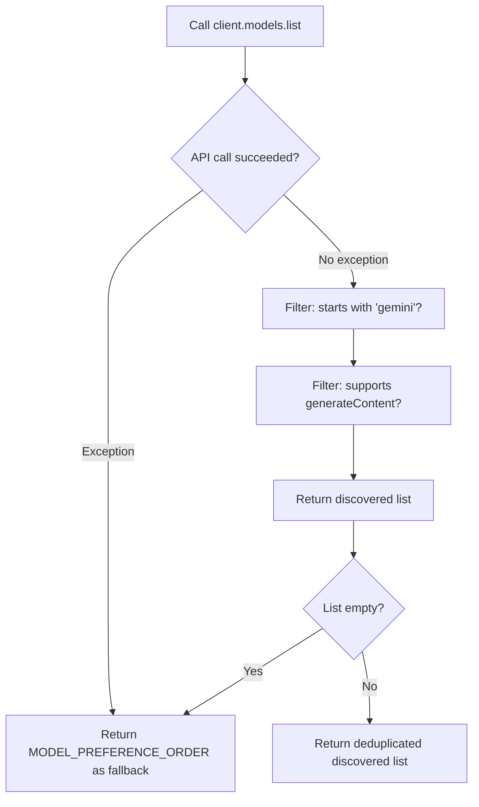
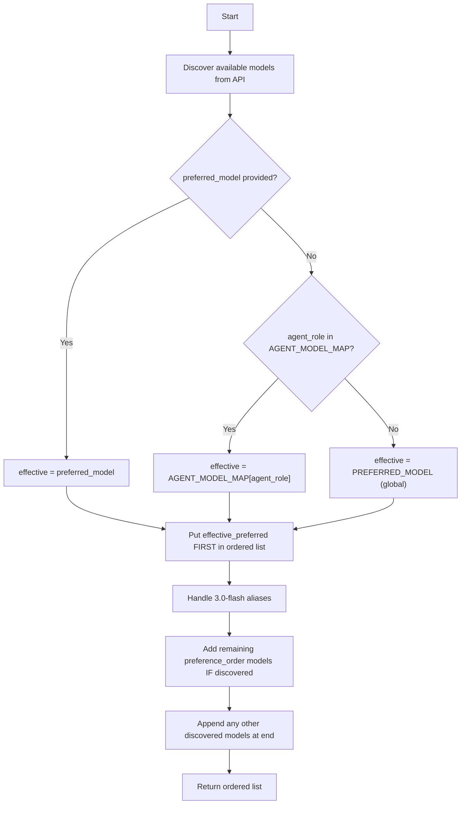
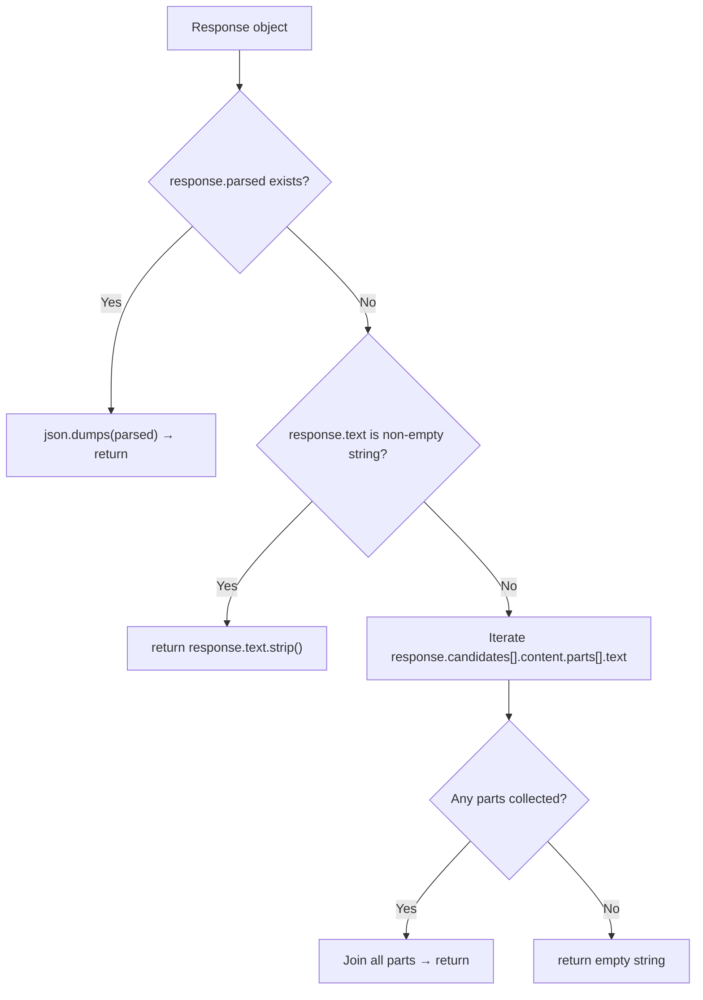
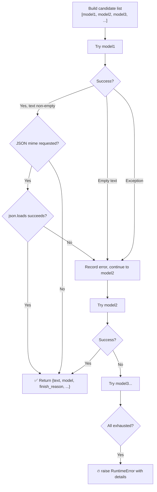
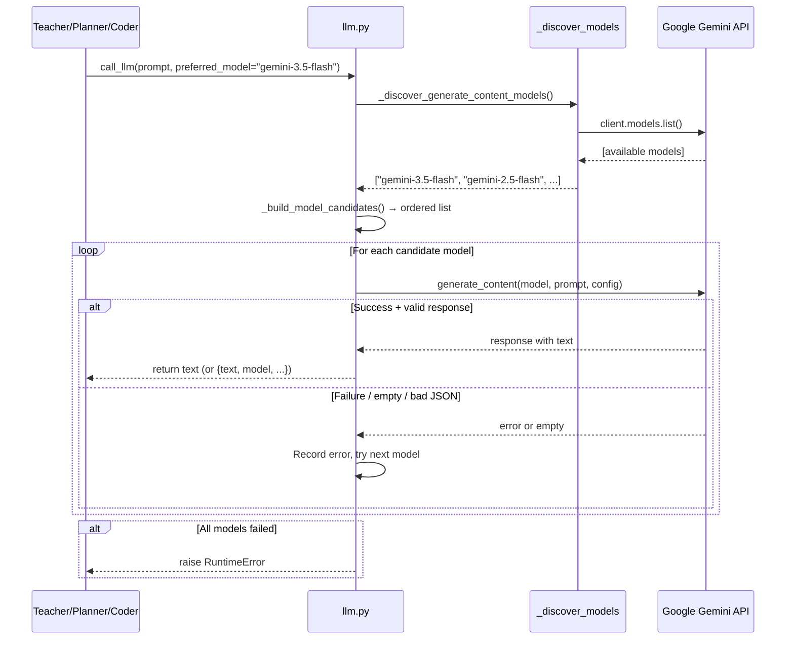

# `agent/llm.py` — Full Deep Dive

This is the **central LLM gateway** for the entire AnimAI Studio pipeline. Every agent (Teacher, Planner, Coder, Debugger, Advisor) calls through this single module. It handles model selection, fallback chains, API communication, response parsing, and error recovery.

---

## 1. Module Initialization (Lines 1–17)

```python
import json
import os
from typing import Any, List

from dotenv import load_dotenv
from google import genai
from google.genai import types

load_dotenv()

GEMINI_API_KEY = os.getenv("GEMINI_API_KEY")
if not GEMINI_API_KEY:
    raise ValueError("GEMINI_API_KEY not found...")

client = genai.Client(api_key=GEMINI_API_KEY)
```

### What happens at import time

This code runs **once** when any agent first does `from agent.llm import call_llm`. The sequence is:

1. **`load_dotenv()`** — Reads `.env` file from project root, injects key-value pairs into `os.environ`
2. **`os.getenv("GEMINI_API_KEY")`** — Fetches the API key (now available thanks to step 1)
3. **Guard clause** — If no key is found, the app **crashes immediately** with a clear error. This is a *fail-fast* pattern — better to crash at startup than produce cryptic errors later
4. **`genai.Client(...)`** — Creates a **singleton** Gemini API client. This client is reused for ALL subsequent calls across all agents. No new clients are ever created

> [!IMPORTANT]
> Because `client` is module-level, it's created once and shared. This means all agents share the same API key and connection pool — which is efficient but means one bad key kills everything.

---

## 2. Model Configuration (Lines 19–34)

```python
PREFERRED_MODEL = os.getenv("GEMINI_MODEL", "gemini-3.5-flash")
MODEL_PREFERENCE_ORDER = [
    PREFERRED_MODEL,
    "gemini-3.5-flash",
    "gemini-2.5-flash",
    "gemini-3.1-flash-lite",
    "gemini-2.5-flash-lite",
]

AGENT_MODEL_MAP: dict[str, str] = {
    "teacher":  os.getenv("TEACHER_MODEL",  "gemini-2.5-flash"),
    "planner":  os.getenv("PLANNER_MODEL",  "gemini-3.5-flash"),
    "coder":    os.getenv("CODER_MODEL",    "gemini-3.5-flash"),
    "debugger": os.getenv("DEBUGGER_MODEL", "gemini-2.5-flash-lite"),
}
```

### Three levels of model selection

```
Priority 1: preferred_model argument     ← Caller explicitly says "use this model"
Priority 2: AGENT_MODEL_MAP[agent_role]  ← Per-agent default from .env
Priority 3: PREFERRED_MODEL              ← Global fallback from GEMINI_MODEL env var
```

### Why `MODEL_PREFERENCE_ORDER` exists

This is the **fallback chain**. If the primary model fails (rate limit, quota, outage), the system tries the next model in the list. The order is:

| Position | Model | Why |
|---|---|---|
| 1st | `gemini-3.5-flash` | Best quality, latest |
| 2nd | `gemini-2.5-flash` | Proven reliable, good quality |
| 3rd | `gemini-3.1-flash-lite` | Lightweight, higher quota limits |
| 4th | `gemini-2.5-flash-lite` | Last resort, cheapest |

### Why `AGENT_MODEL_MAP` exists

Distributes API quota across models. If Coder and Planner both use `gemini-3.5-flash`, they share that model's rate limit. But Teacher uses `gemini-2.5-flash` — a separate quota pool. This prevents one heavy agent from starving others.

---

## 3. `_normalize_model_name()` (Lines 36–39)

```python
def _normalize_model_name(name: str) -> str:
    if not name:
        return ""
    return name.replace("models/", "")
```

**Purpose**: The Google API sometimes returns model names prefixed with `"models/"` (e.g., `"models/gemini-2.5-flash"`). This strips that prefix so we always compare apples to apples: `"gemini-2.5-flash"`.

---

## 4. `_discover_generate_content_models()` (Lines 42–66)

```python
def _discover_generate_content_models() -> List[str]:
    discovered: List[str] = []
    try:
        for model in client.models.list():
            model_name = _normalize_model_name(getattr(model, "name", ""))
            if not model_name.startswith("gemini"):
                continue
            supported = getattr(model, "supported_actions", None) or []
            if supported and "generateContent" not in supported:
                continue
            discovered.append(model_name)
    except Exception:
        return list(dict.fromkeys(MODEL_PREFERENCE_ORDER))

    if not discovered:
        return list(dict.fromkeys(MODEL_PREFERENCE_ORDER))

    return list(dict.fromkeys(discovered))
```

### What this does

Makes a **real API call** to Google to ask: *"What models can this API key access?"*



### Key design decisions

- **`getattr(model, "name", "")`** — Uses `getattr` instead of `model.name` because the SDK response object structure can vary across versions. This is **defensive coding** against SDK changes
- **`list(dict.fromkeys(...))`** — Deduplicates while preserving order (Python 3.7+ dict insertion order guarantee). If `PREFERRED_MODEL` is `"gemini-3.5-flash"` and it's also in the list, we don't want it twice
- **Broad `except Exception`** — If the network is down, the API rejects the key, or anything else goes wrong, we silently fall back to hardcoded model names rather than crashing

> [!NOTE]
> This function is called on **every LLM request** (via `_build_model_candidates`). It's not cached, meaning it hits the API's model listing endpoint each time. This ensures fresh data but adds latency (~100-300ms per call).

---

## 5. `_build_model_candidates()` (Lines 69–120)

This is the **brain** of model selection. It builds the ordered list of models to try.

```python
def _build_model_candidates(preferred_model=None, agent_role=None) -> List[str]:
```

### The algorithm step-by-step



### Detailed walkthrough

**Step 1 — Determine the effective preferred model** (lines 82–88):
```python
if preferred_model:
    effective_preferred = _normalize_model_name(preferred_model)
elif agent_role and agent_role.lower() in AGENT_MODEL_MAP:
    effective_preferred = _normalize_model_name(AGENT_MODEL_MAP[agent_role.lower()])
else:
    effective_preferred = _normalize_model_name(PREFERRED_MODEL)
```
Three-tier priority: explicit arg > agent role lookup > global default.

**Step 2 — Always try the preferred model first** (lines 100–102):
```python
if preferred_normalized:
    ordered.append(preferred_normalized)
```
Even if discovery didn't find it (preview models sometimes aren't listed), we still try it. Worst case, it 404s and we move to the next.

**Step 3 — Alias handling** (lines 104–108):
```python
if preferred_normalized == "gemini-3-flash-preview":
    for alias in ["gemini-3.0-flash-preview", "gemini-3.0-flash-exp"]:
```
Google sometimes renames preview models. This ensures we try known aliases.

**Step 4 — Add preference-ordered models** (lines 110–113):
```python
for model_name in preference_order:
    if normalized in available_set and normalized not in ordered:
        ordered.append(normalized)
```
Only adds models that were **actually discovered** as available AND aren't already in the list.

**Step 5 — Add remaining discovered models** (lines 116–118):
```python
for model_name in available:
    if model_name not in ordered:
        ordered.append(model_name)
```
Any models the API key has access to that we didn't explicitly prefer — add them as a last resort.

### Example output

For the Coder agent (`agent_role="coder"`):
```python
["gemini-3.5-flash", "gemini-2.5-flash", "gemini-3.1-flash-lite", "gemini-2.5-flash-lite", ...]
```

For the Debugger agent (`agent_role="debugger"`):
```python
["gemini-2.5-flash-lite", "gemini-3.5-flash", "gemini-2.5-flash", "gemini-3.1-flash-lite", ...]
```

Notice how the debugger tries the cheapest model first — saving quota for the coder.

---

## 6. `_extract_text_from_response()` (Lines 123–157)

This function handles **three different ways** the SDK might return text:



### Why three extraction methods?

| Method | When it works | Why it might not |
|---|---|---|
| `response.parsed` | When `response_schema` is used (structured output) | Not all requests use schemas |
| `response.text` | Simple text generation | Can be `None` on safety-blocked or empty responses |
| `candidates[].content.parts[].text` | Always, as the raw format | Verbose but reliable fallback |

> [!TIP]
> The `parsed` path uses `json.dumps(parsed, ensure_ascii=True)` — the `ensure_ascii=True` flag converts non-ASCII characters to escape sequences, preventing encoding issues downstream when the JSON is embedded in other prompts.

---

## 7. `_extract_finish_reason()` (Lines 160–174)

```python
reason = getattr(candidates[0], "finish_reason", None)
return str(getattr(reason, "name", reason))
```

Returns why the model stopped generating. Key values:

| Finish Reason | Meaning | Action taken |
|---|---|---|
| `STOP` | Normal completion | ✅ Use the response |
| `MAX_TOKENS` | Output truncated | 🔄 Coder triggers continuation loop |
| `SAFETY` | Content blocked | ⚠️ Empty text → try next model |
| `unknown` | Couldn't extract | Proceed cautiously |

The `getattr(reason, "name", reason)` handles both enum objects (`.name` property) and plain strings.

---

## 8. `call_llm()` — The Simple API (Lines 177–198)

```python
def call_llm(prompt, max_tokens=3000, response_mime_type=None,
             response_schema=None, preferred_model=None,
             disable_thinking=False, agent_role=None) -> str:
```

**This is a thin wrapper** around `call_llm_detailed()`. It exists for backward compatibility — most agents only need the text, not the metadata.

```python
result = call_llm_detailed(...)
return result["text"]    # Throws away model name, finish_reason, etc.
```

Used by: `teacher.py`, `planner.py`, `debugger.py`, `topic_hints.py`

---

## 9. `call_llm_detailed()` — The Full API (Lines 201–281)

This is the **core function** — the actual Gemini API caller with retry logic.

### The retry/fallback loop



### Config building (lines 226–244)

```python
config_kwargs = {
    "max_output_tokens": max_tokens,
    "temperature": 0.2,
}
```

| Config | Value | Why |
|---|---|---|
| `max_output_tokens` | 3000 (default) | Limits response length. Coder passes 16384 for long code |
| `temperature` | 0.2 | Low randomness = deterministic, consistent output. Educational content needs accuracy, not creativity |

#### Optional configs:

- **`disable_thinking`** (lines 230–235): Sets `thinking_budget=0` to skip Gemini's internal chain-of-thought reasoning. Used by the Coder and Debugger to get faster, more direct code output
- **`response_mime_type`** (line 237): Set to `"application/json"` to force JSON output
- **`response_schema`** (line 239): Provides a JSON schema so Gemini returns structured data matching that shape

### The JSON validation guard (lines 253–260)

```python
if response_mime_type == "application/json":
    try:
        json.loads(text)
    except Exception as parse_err:
        last_error = RuntimeError(f"Model '{model_name}' returned invalid JSON...")
        continue   # ← Try next model!
```

Even when you ask Gemini for JSON output, it can sometimes return malformed JSON. This guard:
1. Attempts to parse the JSON
2. If parsing fails → records the error and **tries the next model**
3. Only a successfully-parsed JSON response is returned

> [!WARNING]
> This means a single request can hit **multiple models** — first `gemini-3.5-flash` returns bad JSON, then `gemini-2.5-flash` returns valid JSON. The caller never knows which model actually served the response (unless they use `call_llm_detailed` and check `result["model"]`).

### The return payload

```python
return {
    "text": text,                      # The actual LLM output
    "model": model_name,               # Which model succeeded
    "finish_reason": finish_reason,     # STOP, MAX_TOKENS, etc.
    "candidates_tried": candidates,    # Full fallback list (for debugging)
    "error": None,                     # No error on success
}
```

Used by: `coder.py` — which checks `finish_reason` to decide if a continuation call is needed (when `MAX_TOKENS` indicates truncation).

### The final error (lines 276–281)

```python
raise RuntimeError(
    "Gemini request failed for all configured/discovered models. "
    f"Tried: {candidates}. Last error: {last_error}"
)
```

If **every model** in the candidate list fails, this is an unrecoverable error. The error message includes which models were tried and what the last error was — invaluable for debugging API key issues, quota exhaustion, or network problems.

---

## 10. Complete Data Flow



---

## 11. Key Design Patterns Summary

| Pattern | Where | Why |
|---|---|---|
| **Fail-fast** | Line 14-15 (API key check) | Crash at startup, not mid-pipeline |
| **Singleton client** | Line 17 | One connection pool, shared across agents |
| **Fallback chain** | Lines 224-274 (for loop) | Resilience against quota/outages |
| **Defensive getattr** | Lines 50, 128, 135, 167 | SDK version compatibility |
| **Dedup with order** | `list(dict.fromkeys(...))` | No duplicate models, preserves priority |
| **JSON guard** | Lines 253-260 | Retry on malformed JSON instead of crashing |
| **Thin wrapper** | `call_llm` wrapping `call_llm_detailed` | Backward compat + simple API for most agents |
